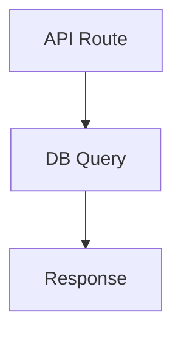

# CodeLax — AI-Powered Code Review Platform
## Complete Project Data for Presentation

---

## 1. PROJECT OVERVIEW

**CodeLax** is a full-stack AI-powered code review platform that automatically reviews pull requests/merge requests using a multi-agent AI pipeline. It supports GitHub, GitLab, and Bitbucket, and includes a VS Code extension for local reviews.

**Live URL:** https://code-lax.vercel.app  
**GitHub Repo:** https://github.com/sou-goog/CodeLax  
**Internship Project** — Built from scratch during Intern 2026

---

## 2. TECH STACK

### Web Application
| Layer | Technology |
|-------|-----------|
| Framework | Next.js 15 (App Router, React 19) |
| Language | TypeScript |
| Styling | TailwindCSS + Radix UI (shadcn/ui components) |
| Database | PostgreSQL (Neon serverless) |
| ORM | Prisma |
| Auth | better-auth (OAuth — GitHub, GitLab) |
| Async Jobs | Inngest (event-driven, step functions) |
| Vector DB | Pinecone (for RAG embeddings) |
| AI Models | Groq (Llama 3.3 70B), OpenRouter (Gemini 2.0), Google Gemini |
| Hosting | Vercel |
| Charts | Recharts |
| Animations | Motion (Framer Motion) |

### VS Code Extension
| Layer | Technology |
|-------|-----------|
| Runtime | VS Code Extension API |
| Language | TypeScript |
| UI | Webview (HTML/CSS/JS) |
| Communication | REST API to CodeLax server |

### External Integrations
- GitHub API (Octokit) — webhooks, PR comments, check runs, labels
- GitLab API — webhooks, MR comments, labels
- Bitbucket API — webhooks, PR comments
- Slack API — critical finding notifications
- Pinecone — vector similarity search for RAG

---

## 3. ARCHITECTURE DIAGRAM

```
┌─────────────────────────────────────────────────────────────────────┐
│                        USER INTERFACES                               │
├──────────────┬──────────────────┬────────────────────────────────────┤
│  Web Dashboard  │  VS Code Extension  │  Git Provider (GitHub/GitLab/BB) │
└──────┬───────┴────────┬─────────┴──────────────┬─────────────────────┘
       │                │                        │
       ▼                ▼                        ▼
┌─────────────────────────────────────────────────────────────────────┐
│                    NEXT.JS API LAYER                                  │
│  • /api/webhooks/github   — PR event handler                         │
│  • /api/webhooks/gitlab   — MR event handler                         │
│  • /api/webhooks/bitbucket — PR event handler                        │
│  • /api/extension/local-review — file/staged changes review          │
│  • /api/inngest — Inngest event bus                                  │
└──────────────────────────────┬──────────────────────────────────────┘
                               │
                               ▼
┌─────────────────────────────────────────────────────────────────────┐
│                    INNGEST (Async Orchestration)                      │
│                                                                       │
│  Event: "pr.review.requested"                                        │
│  Function: generateReviewMultiAgent                                  │
│  Concurrency: 3 | Retries: 2 | onFailure handler                    │
└──────────────────────────────┬──────────────────────────────────────┘
                               │
                               ▼
┌─────────────────────────────────────────────────────────────────────┐
│              MULTI-AGENT AI PIPELINE (8 Steps)                       │
│                                                                       │
│  Step 1: Create pending review record                                │
│  Step 2: Fetch PR data + .codelax.yaml config                        │
│  Step 3: Dedup check (skip if same diffHash)                         │
│  Step 4: Create Check Run (GitHub) — "in_progress"                   │
│  Step 5: Prepare (diff parse, complexity, RAG, Planner)              │
│  Step 6: Run Specialists (Security, Performance, Logic, Style)       │
│  Step 7: Critic verification + Slack notification                    │
│  Step 8: Synthesizer → Post results → Save to DB                     │
└──────────────────────────────┬──────────────────────────────────────┘
                               │
                               ▼
┌─────────────────────────────────────────────────────────────────────┐
│                    OUTPUT (per review)                                │
│  • Summary comment on PR/MR                                          │
│  • Inline comments on specific lines                                 │
│  • Auto-fix suggestions (```suggestion format)                       │
│  • Auto-labels (critical-issues, needs-fix, security-concern, etc.)  │
│  • Check Run status (pass/fail/neutral)                              │
│  • Mermaid architecture diagram                                      │
│  • Complexity score badge (0-100)                                    │
│  • Slack notification (for critical/high severity)                   │
│  • DB record with duration, findings, status                         │
└─────────────────────────────────────────────────────────────────────┘
```

---

## 4. MULTI-AGENT AI PIPELINE (Core Innovation)

### Agent Roles

| Agent | Role | What It Analyzes |
|-------|------|-----------------|
| **Planner** | Orchestrator | Reads the diff, assigns tasks to specialists, determines which agents to activate |
| **Security Agent** | Specialist | SQL injection, XSS, auth bypass, secret leaks, OWASP vulnerabilities |
| **Performance Agent** | Specialist | N+1 queries, memory leaks, unnecessary re-renders, algorithmic complexity |
| **Logic Agent** | Specialist | Race conditions, null pointer risks, edge cases, incorrect business logic |
| **Style Agent** | Specialist | Code style, naming conventions, dead code, documentation gaps |
| **Critic** | Verifier | Cross-validates all specialist findings, removes false positives, assigns confidence scores |
| **Synthesizer** | Writer | Compiles final review with markdown formatting, mermaid diagrams, severity badges |
| **Evaluator** | Quality Gate | Scores the final review (0-100) on traceability, accuracy, suggestions, completeness; triggers regeneration if below threshold |

### Pipeline Flow Diagram
```
PR/MR Opened or Pushed
       │
       ▼
┌─── Planner ───┐         (Light model tier)
│ Reads diff,    │
│ assigns tasks  │
└───┬──┬──┬──┬──┘
    │  │  │  │
    ▼  ▼  ▼  ▼
┌────┐┌────┐┌────┐┌────┐
│Sec ││Perf││Logic││Style│  ← Specialists (Standard tier + language hints)
└──┬─┘└──┬─┘└──┬─┘└──┬─┘
   │     │     │     │
   └─────┴─────┴─────┘
         │
         ▼
  ┌─ Deterministic ─┐
  │ Verifier         │     ← NEW: mechanical check (no LLM)
  │ • File in diff?  │     Rejects hallucinated findings
  │ • Line in hunk?  │     at zero cost before Critic
  │ • Snippet match? │
  └───────┬──────────┘
          │
          ▼
    ┌── Critic ──┐         (Strong model tier)
    │ Verifies   │
    │ findings   │
    │ Scores     │
    │ confidence │
    └─────┬──────┘
          │
          ▼
   ┌─ Synthesizer ─┐      (Strong model tier)
   │ Formats final  │
   │ review with    │
   │ diagrams &     │
   │ badges         │
   └───────┬────────┘
           │
           ▼
   ┌── Evaluator ──┐       ← NEW: review-of-review
   │ Scores quality │      Traceability, Accuracy,
   │ 0-100 score    │      Suggestions, Completeness
   │ Score < 60?    │
   │  → Regenerate  │
   └────────────────┘
```

### How RAG (Retrieval-Augmented Generation) Works
1. When a repo is first connected, files are chunked (4000 chars, 200 overlap)
2. Each chunk is embedded using Google's `gemini-embedding-2` model
3. Embeddings are stored in Pinecone with metadata (repoId, file path)
4. During review, the diff is used to retrieve top-K relevant code chunks
5. This context is provided to specialists so they understand the broader codebase

---

## 5. ALL FEATURES (32 Total)

### Core Review Features
1. **Multi-agent AI review** — 4 specialist agents + critic + synthesizer
2. **Inline review comments** — configurable max count, severity threshold
3. **Auto-fix suggestions** — GitHub ```suggestion format for one-click apply
4. **PR description generator** — AI-generated PR descriptions
5. **Incremental reviews** — only reviews new commits on push (synchronize events)
6. **Smart dedup** — diffHash skips identical diffs already reviewed
7. **File ignore patterns** — .codelax.yaml ignore patterns via glob matching

### Intelligence Features
8. **RAG-powered context** — Pinecone vector search for codebase understanding
9. **Multi-language detection** — auto-detects languages in diff, provides context to agents
10. **PR complexity score** — 0-100 score based on lines, files, patterns
11. **Mermaid diagrams** — architecture visualization in reviews

### Review Quality Features (NEW)
12. **Deterministic pre-filter** — mechanically verifies findings reference real files, lines, and snippets in the diff before LLM Critic; eliminates hallucinations at zero cost
13. **Self-evaluation & regeneration** — Evaluator agent scores final review (0-100) on traceability, accuracy, suggestion quality, completeness; auto-regenerates if score < 60
14. **Role-specific model routing** — Strong tier (Critic/Synthesizer), Standard tier (Specialists), Light tier (Planner) with per-tier fallback chains
15. **Language-specific knowledge injection** — TypeScript, JavaScript, Python, Java, Go, Rust patterns injected into specialist prompts (security, performance, logic)

### Integration Features
16. **GitHub Check Runs** — pass/fail/neutral status directly on PRs
17. **Auto-labels** — critical-issues, needs-fix, security-concern, ai-approved
18. **Slack notifications** — alerts for critical/high severity findings
19. **Multi-provider rotation** — Groq (1-10 keys) → OpenRouter → Gemini with auto-fallback

### Multi-Provider Support
20. **GitHub integration** — full OAuth + webhooks + PR comments + check runs + labels
21. **GitLab integration** — OAuth + webhooks + MR comments + labels
22. **Bitbucket integration** — webhooks + PR comments
23. **Git Provider Abstraction** — unified interface for all providers

### VS Code Extension
24. **Sidebar panel** — view all review findings in VS Code
25. **Review Current File** — instant AI review of the current file
26. **Review Staged Changes** — review git staged diff before committing

### Configuration & Monitoring
27. **.codelax.yaml config** — agents, ignore, minSeverity, maxInlineComments, instructions
28. **Review status tracking** — pending → in_progress → completed/failed/skipped
29. **Duration tracking** — durationMs, startedAt, completedAt
30. **Analytics dashboard** — charts, stats, trends
31. **Re-trigger button** — manually re-run review from UI
32. **Teams support** — team-based repo management with roles

---

## 6. DATABASE SCHEMA

### Models (10 tables)
| Model | Purpose |
|-------|---------|
| `user` | User accounts with extensionApiKey |
| `account` | OAuth provider tokens (GitHub, GitLab) |
| `session` | Active user sessions |
| `repository` | Connected repos (multi-provider: github/gitlab/bitbucket) |
| `review` | AI review records with status, duration, diffHash |
| `review_finding` | Individual findings (severity, file, line, suggestion) |
| `review_rule` | Custom per-repo review rules |
| `team` / `team_member` / `team_invite` | Team collaboration |
| `notification` | In-app notifications |
| `activity_event` | User activity tracking |

### Key Fields
- `repository.provider` — "github" | "gitlab" | "bitbucket"
- `review.status` — "pending" | "in_progress" | "completed" | "failed" | "skipped"
- `review.diffHash` — SHA-256 of diff for dedup
- `review.durationMs` — time taken for the review
- `review_finding.severity` — "critical" | "high" | "medium" | "low"
- `review_finding.confidence` — 0.0 to 1.0 (set by critic agent)

---

## 7. VS CODE EXTENSION

### Commands
| Command | Description |
|---------|-------------|
| `CodeLax: Refresh Reviews` | Refresh sidebar with latest reviews |
| `CodeLax: Configure API Key` | Set API key for authentication |
| `CodeLax: Open in Browser` | Open review in web dashboard |
| `CodeLax: Review Current File` | AI review the active file |
| `CodeLax: Review Staged Changes` | AI review git staged diff |
| `CodeLax: Jump to Finding` | Navigate to a specific finding |

### Features
- Activity bar icon with dedicated sidebar
- Webview showing grouped findings by severity
- Click-to-navigate: clicking a finding jumps to the file/line
- VS Code diagnostics (squiggly underlines) for findings
- Auto-refresh on configurable interval
- Works with any git provider (not just GitHub)
- Local review mode: reviews code without needing a PR

---

## 8. MULTI-PROVIDER ARCHITECTURE

### Git Provider Abstraction (`git-provider.ts`)
```typescript
interface GitProvider {
  fetchPR(owner, repo, prNumber): Promise<PRData>;
  fetchIncrementalDiff(owner, repo, base, head): Promise<string>;
  postComment(owner, repo, prNumber, body): Promise<void>;
  postInlineComments(owner, repo, prNumber, commitSha, comments): Promise<void>;
  addLabels(owner, repo, prNumber, labels): Promise<void>;
  createCheckRun(...): Promise<number | null>;  // GitHub only
  updateCheckRun(...): Promise<void>;           // GitHub only
}
```

### Implementations
- `GitHubProvider` — uses Octokit (full feature set)
- `GitLabProvider` — uses GitLab REST API v4
- `BitbucketProvider` — uses Bitbucket REST API v2.0

### Factory Pattern
```typescript
function createGitProvider(provider: string, token: string): GitProvider
```

---

## 9. MODEL PROVIDER ROTATION (Cost Optimization)

```
Priority Chain:
┌──────────────────────────────────────────┐
│ 1. Groq llama-3.3-70b (keys 1-10)       │  ← Fastest, free tier
│ 2. OpenRouter gemini-2.0-flash-exp:free  │  ← Free fallback
│ 3. Google gemini-2.0-flash-lite          │  ← Final fallback
└──────────────────────────────────────────┘
```

- Supports up to 10 Groq API keys via comma-separated env var or GROQ_API_KEY_2..10
- Auto-detects rate limit (429/quota/TPD errors)
- Exhausted providers are skipped for 1 hour
- Falls back to next provider automatically
- **Result: Essentially free operation** at moderate scale

---

## 10. WEBHOOK FLOW (How Reviews Get Triggered)

### GitHub
1. User opens/pushes to PR
2. GitHub sends POST to `/api/webhooks/github`
3. Server verifies HMAC-SHA256 signature
4. Parses payload (owner, repo, PR#, action)
5. Sends `pr.review.requested` event to Inngest
6. Multi-agent pipeline runs asynchronously
7. Results posted back as PR comment + inline comments

### GitLab
1. User opens/updates MR
2. GitLab sends POST to `/api/webhooks/gitlab`
3. Server verifies X-Gitlab-Token header
4. Parses payload (project path, MR IID, action)
5. Same Inngest event → same pipeline → results on MR

### Bitbucket
1. User creates/updates PR
2. Bitbucket sends POST to `/api/webhooks/bitbucket`
3. Parses payload (full_name, PR ID)
4. Same Inngest event → same pipeline → results on PR

---

## 11. CONFIGURATION (.codelax.yaml)

Users can place a `.codelax.yaml` in their repo root:

```yaml
# Which specialist agents to run
agents:
  - security
  - performance
  - logic
  - style

# Files/patterns to ignore
ignore:
  - "**/*.test.ts"
  - "dist/**"
  - "node_modules/**"
  - "*.lock"

# Minimum severity for inline comments
minSeverity: medium

# Maximum inline comments per review
maxInlineComments: 5

# Custom instructions for agents
instructions: "Focus on TypeScript best practices. Our team uses functional components only."

# Auto-generate PR descriptions
autoDescription: true
```

---

## 12. DASHBOARD PAGES

| Page | Functionality |
|------|---------------|
| `/dashboard` | Overview with stats, recent reviews, activity |
| `/dashboard/repository` | Connect repos (GitHub/GitLab/Bitbucket tabs) |
| `/dashboard/reviews` | All reviews with status badges, duration, filters |
| `/dashboard/reviews/[id]` | Detailed single review with findings |
| `/dashboard/reviews/compare` | Compare two reviews side-by-side |
| `/dashboard/analytics` | Charts: reviews over time, severity distribution |
| `/dashboard/settings` | API key, extension setup, account management |
| `/dashboard/teams` | Team management (invite, roles) |
| `/dashboard/rules` | Custom review rules per repository |
| `/dashboard/webhooks` | Webhook configuration & status |
| `/dashboard/activity` | User activity timeline |
| `/dashboard/config` | Global configuration |
| `/dashboard/onboarding` | First-time setup wizard |

---

## 13. PROJECT STRUCTURE

```
CodeLax/
├── app/                          # Next.js App Router
│   ├── (auth)/
│   │   ├── login/page.tsx        # Login (GitHub + GitLab OAuth)
│   │   └── api/webhooks/
│   │       ├── github/route.ts   # GitHub webhook handler
│   │       ├── gitlab/route.ts   # GitLab webhook handler
│   │       └── bitbucket/route.ts # Bitbucket webhook handler
│   ├── api/
│   │   ├── extension/local-review/route.ts  # Local file/staged review
│   │   └── inngest/route.ts      # Inngest event handler
│   ├── dashboard/                # All dashboard pages
│   └── page.tsx                  # Landing page
│
├── module/
│   ├── ai/
│   │   ├── agents/               # AI agent implementations
│   │   │   ├── planner.ts
│   │   │   ├── security.ts
│   │   │   ├── performance.ts
│   │   │   ├── logic.ts
│   │   │   ├── style.ts
│   │   │   ├── critic.ts
│   │   │   ├── synthesizer.ts
│   │   │   ├── evaluator.ts       # NEW: review quality scorer + regeneration
│   │   │   └── types.ts
│   │   └── lib/
│   │       ├── git-provider.ts    # Multi-provider abstraction
│   │       ├── model-provider.ts  # AI model rotation + role-specific tiers
│   │       ├── finding-verifier.ts # NEW: deterministic pre-filter
│   │       ├── language-hints.ts  # NEW: language-specific patterns
│   │       ├── rag.ts             # RAG pipeline (Pinecone)
│   │       ├── diff-parser.ts     # Diff parsing + complexity
│   │       ├── config.ts          # .codelax.yaml parser
│   │       └── notifications.ts   # Slack integration
│   ├── auth/                     # Auth UI components
│   ├── repository/               # Repo actions & hooks
│   ├── github/                   # GitHub-specific utilities
│   └── settings/                 # Settings components
│
├── inngest/
│   ├── client.ts                 # Inngest client
│   └── functions/
│       └── multi-agent-review.ts # Main pipeline function
│
├── prisma/
│   └── schema.prisma             # Database schema (10 models)
│
├── lib/
│   ├── auth.ts                   # better-auth config (GitHub + GitLab)
│   ├── auth-client.ts            # Client-side auth
│   ├── db.ts                     # Prisma client
│   └── pinecone.ts               # Pinecone client
│
├── codelax-vscode/               # VS Code Extension
│   ├── src/
│   │   ├── extension.ts          # Main extension (commands, activation)
│   │   ├── sidebar.ts            # Webview sidebar provider
│   │   ├── api.ts                # API client for CodeLax server
│   │   ├── diagnostics.ts        # VS Code diagnostics integration
│   │   ├── codelens.ts           # CodeLens integration
│   │   ├── quickfix.ts           # Quick fix code actions
│   │   └── statusbar.ts          # Status bar indicator
│   └── package.json              # Extension manifest
│
└── package.json                  # Root dependencies
```

---

## 14. KEY DIFFERENTIATORS

| Feature | CodeLax | Competitors (CodeRabbit, etc.) |
|---------|---------|-------------------------------|
| Multi-agent architecture | ✅ 4 specialists + critic | Single-pass LLM |
| RAG context | ✅ Pinecone embeddings | Limited context |
| Multi-provider | ✅ GitHub + GitLab + Bitbucket | GitHub only (mostly) |
| Free operation | ✅ Groq free tier rotation | Paid subscription |
| VS Code extension | ✅ Full sidebar + local review | Web only |
| Self-hostable | ✅ Open source, Vercel deploy | SaaS only |
| Check Runs | ✅ Pass/fail on PRs | Comments only |
| Incremental reviews | ✅ Only new commits | Full re-review |
| Hallucination filter | ✅ Deterministic verifier pre-LLM | None |
| Self-evaluation | ✅ Auto-scores & regenerates reviews | No quality check |
| Language-aware | ✅ Per-language patterns (6 languages) | Generic prompts |
| Model routing | ✅ Role-specific tiers (strong/standard/light) | Single model |
| Custom config | ✅ .codelax.yaml | Limited settings |
| Team collaboration | ✅ Teams, roles, invites | Per-user |

---

## 15. SECURITY MEASURES

- **Webhook signature verification** — HMAC-SHA256 for GitHub, token for GitLab
- **OAuth2 authentication** — no passwords stored
- **API key auth** for extension — unique per-user keys
- **No secrets in code** — all via environment variables
- **Cascade auth** — better-auth sessions with CSRF protection
- **DB-level cascade deletes** — removing user removes all associated data

---

## 16. DEPLOYMENT & DEVOPS

- **Vercel** for the Next.js app (auto-deploy from GitHub push)
- **Neon** serverless PostgreSQL (auto-scaling)
- **Pinecone** serverless vector DB
- **Inngest** cloud for async job processing
- **Build pipeline:** `prisma generate → prisma db push → next build`
- **Environment variables:** 15+ env vars managed in Vercel dashboard

---

## 17. HOW EVERYTHING WORKS — DEEP DIVE

This section provides a thorough, end-to-end walkthrough of every component in the CodeLax platform. It explains the internal logic, data flow, and algorithms used at each stage.

---

### 17.1 How a PR Review Works (End-to-End) — Complete Data Flow

This section traces every piece of data from the moment a developer pushes code to the moment findings appear on their PR. It shows the exact inputs/outputs, prompt structures, and decision logic at each stage.

---

#### PHASE 1: Webhook Reception & Event Dispatch

**Trigger:** A developer opens a PR or pushes commits to an existing PR.

**What happens in the webhook handler (`app/(auth)/api/webhooks/github/route.ts`):**

```
1. GitHub sends HTTP POST to https://code-lax.vercel.app/api/webhooks/github
   Headers:
     - X-Hub-Signature-256: sha256=<HMAC digest>
     - X-GitHub-Event: "pull_request"
   Body: { action: "opened"|"synchronize"|"reopened", pull_request: {...}, repository: {...} }

2. Server reads raw body as text (needed for signature verification)

3. HMAC-SHA256 Verification:
   digest = HMAC_SHA256(GITHUB_WEBHOOK_SECRET, rawBody)
   expected = "sha256=" + hex(digest)
   Compare using crypto.timingSafeEqual(expected, header_signature)
   → If mismatch → return 401
   → This prevents anyone from forging webhook calls

4. Extract data from payload:
   owner = body.repository.owner.login     (e.g., "sou-goog")
   repo  = body.repository.name            (e.g., "CodeLax")
   prNumber = body.pull_request.number      (e.g., 15)
   action = body.action                     (e.g., "opened")
   before = body.before                     (previous HEAD SHA, for incremental)
   after  = body.after                      (new HEAD SHA, for incremental)

5. Database lookup:
   SELECT * FROM repository WHERE owner='sou-goog' AND name='CodeLax'
   → Gets repository.userId (the user who connected this repo)
   → If not found → return 200 "Repository not connected" (silent skip)

6. Fire Inngest event:
   inngest.send({
     name: "pr.review.requested",
     data: { owner, repo, prNumber, userId, action, before, after }
   })
   → Returns 200 immediately (decoupled — review runs async)
```

**Why this design:** The webhook handler must respond within seconds or GitHub will retry. All heavy processing happens asynchronously in Inngest, which provides retries, concurrency control, and step-level durability.

---

#### PHASE 2: Data Fetching — How the Repository Data is Obtained

**Step: `fetch-pr-data` in `multi-agent-review.ts`**

This step acquires ALL the raw material needed for the review:

```
Input:  { owner, repo, prNumber, userId, action, before, after }
Output: { diff, title, description, token, config, isIncremental }
```

**How the access token is obtained:**
```sql
SELECT accessToken FROM account WHERE userId = '<userId>' AND providerId = 'github'
```
This token was stored during OAuth login (GitHub grants it when the user authorizes CodeLax). It has permissions for: repo read, pull request comments, checks:write, labels.

**How the diff is fetched:**
For GitHub, the `GitHubProvider.fetchPR()` method calls:
```
GET /repos/{owner}/{repo}/pulls/{prNumber}
  → returns: title, description, headSha, baseBranch, headBranch
GET /repos/{owner}/{repo}/pulls/{prNumber}  (with Accept: application/vnd.github.diff)
  → returns: the full unified diff as plain text
```

For **incremental reviews** (action = "synchronize", i.e., new commits pushed to existing PR):
```
GET /repos/{owner}/{repo}/compare/{before}...{after}
  → returns: only the diff between the old HEAD and new HEAD
  → This means the review only covers the NEW commits, not the entire PR
```

**The raw diff looks like this:**
```diff
diff --git a/src/api/users.ts b/src/api/users.ts
index 3a4e8f1..9c2d7b3 100644
--- a/src/api/users.ts
+++ b/src/api/users.ts
@@ -10,6 +10,12 @@ export async function getUsers(req: Request) {
   const users = await db.query("SELECT * FROM users");
+  // Bug: N+1 query pattern
+  for (const user of users) {
+    user.orders = await db.query(
+      "SELECT * FROM orders WHERE user_id = '" + user.id + "'"
+    );
+  }
   return res.json(users);
```

**How `.codelax.yaml` config is fetched:**
```
GET /repos/{owner}/{repo}/contents/.codelax.yaml (base64-encoded)
→ If 404: use defaults (all agents, no ignore, minSeverity="medium", maxInlineComments=5)
→ If found: parse YAML → { agents, ignore, minSeverity, maxInlineComments, instructions }
```

---

#### PHASE 3: Deduplication — Avoiding Redundant Reviews

```
diffDigest = hashDiff(diff)  // fast 32-bit hash of the entire diff string

SELECT id FROM review WHERE diffHash = diffDigest AND status = 'completed' LIMIT 1
→ If found: mark this review as "skipped", return early
→ This prevents re-reviewing when a developer force-pushes without changes
```

---

#### PHASE 4: Data Preparation — Transforming Raw Diff for AI Consumption

This is the most critical data transformation stage. The raw diff is messy — it contains lockfiles, binary diffs, huge auto-generated files. AI agents have limited context windows (typically 128K tokens). The preparation step transforms raw data into clean, prioritized, annotated input.

**4.1 Diff Parsing & Filtering (`prepareDiffForAgents`):**
```
Input:  Raw diff string (could be 500KB for a large PR)
Output: Filtered diff (max 25,000 chars) + filesSummary

Process:
1. Split on "diff --git" boundaries → per-file chunks
2. For each file, check against SKIP_PATTERNS:
   - package-lock.json, yarn.lock → SKIP (noise)
   - *.min.js, *.min.css → SKIP (generated)
   - .next/, node_modules/, dist/ → SKIP (build artifacts)
   - *.png, *.jpg, *.pdf → SKIP (binary)
   - prisma/migrations/ → SKIP (auto-generated)
3. Check against .codelax.yaml ignore patterns:
   - User-defined globs like "**/*.test.ts", "dist/**" → SKIP
4. Sort remaining files:
   - High priority: .ts, .tsx, .py, .go, .rs, .java (source code) — sorted by change count
   - Low priority: tsconfig.json, .eslintrc, tailwind.config (config files)
5. Apply 25,000 char budget:
   - Include files in priority order until budget exhausted
   - If a file exceeds remaining budget but >2000 chars remain, include truncated version
   - Track which files were excluded

Output example:
  "Files changed: 8 total, 5 included in review
    ✔ src/api/users.ts (+12/-3)
    ✔ src/auth/login.ts (+45/-2)
    ✔ src/db/queries.ts (+8/-1)
    ✔ src/utils/validate.ts (+20/-0)
    ✔ src/types/index.ts (+5/-0)
    ✖ package-lock.json (excluded — budget exceeded)
    ✖ tailwind.config.ts (excluded — budget exceeded)
    ✖ README.md (excluded — budget exceeded)"
```

**4.2 Line Number Annotation (`annotateDiffWithLineNumbers`):**

This is a key innovation that prevents AI hallucination of line numbers:
```
Input:
  @@ -10,6 +10,12 @@ export async function getUsers(req: Request) {
     const users = await db.query("SELECT * FROM users");
  +  for (const user of users) {
  +    user.orders = await db.query(

Output (annotated):
  @@ -10,6 +10,12 @@ export async function getUsers(req: Request) {
  L10  const users = await db.query("SELECT * FROM users");
  L11+ for (const user of users) {
  L12+   user.orders = await db.query(

How it works:
- Parse @@ header: "-10,6 +10,12" → old starts at line 10, new starts at line 10
- Track line counters as we iterate:
  - "+" line → prefix with "L{newLine}+", increment newLine
  - "-" line → prefix with "L{oldLine}-", increment oldLine
  - Context line → prefix with "L{newLine} ", increment both
```

Without this annotation, agents frequently say "line 3" when they mean "line 42" (they count from the start of the hunk, not the file). With annotation, agents see the actual line numbers in the code.

**4.3 PR Complexity Scoring:**
```
score = min(100, fileCount×5 + totalChanges×0.05 + hotspotFiles×10 + refactorBonus + widePRBonus)

Example: 5 files changed, 87 additions + 12 deletions, 3 hotspot files
  = 5×5 + 99×0.05 + 3×10 + 0 + 0
  = 25 + 5 + 30 + 0 + 0 = 60/100 ("complex")
```

**4.4 RAG Context Retrieval:**
```
1. Build query: "{PR title}\n{description}\nChanged files: src/api/users.ts, src/auth/login.ts, ..."
2. Embed query → 768-dim vector using gemini-embedding-2
3. Query Pinecone:
   {
     vector: [0.12, -0.34, 0.56, ...],  // 768 dimensions
     filter: { repoId: "sou-goog/CodeLax" },
     topK: scaledTopK(diffLength),       // 3-10 based on diff size
     includeMetadata: true
   }
4. Get back matches with scores (0.0-1.0 cosine similarity):
   [
     { score: 0.89, metadata: { path: "src/db/connection.ts", content: "..." } },
     { score: 0.82, metadata: { path: "src/middleware/auth.ts", content: "..." } },
     ...
   ]
5. Deduplicate by file path (keep highest-scoring chunk per file)
6. Return content strings → these are the "context" chunks given to agents
```

---

#### PHASE 5: The Planner — Deciding Which Agents to Activate

**What data the Planner receives:**
```
System prompt: "You are a code review planning agent..."
  (includes available agents list, activation guidelines, JSON schema)

User prompt:
  "PR Title: Fix user authentication and add pagination
   PR Description: Added JWT validation, fixed SQL queries...
   Code Diff (first 6000 chars):
   ```diff
   <first 6000 chars of the filtered diff>
   ```
   Decide which agents to activate..."
```

**What the Planner outputs:**
```json
{
  "agentsToActivate": ["security", "performance", "logic"],
  "languages": ["typescript"],
  "planNotes": "Security needed for auth changes and SQL queries. Performance for pagination logic. Logic for conditional edge cases. Style skipped — changes are focused on logic, not refactoring.",
  "agentFocusHints": {
    "security": "Focus on src/auth/login.ts L15-30 — raw SQL query with string interpolation. Also check JWT secret handling.",
    "performance": "Check src/api/users.ts L11-16 — N+1 query pattern in a loop. Also verify pagination doesn't load all records.",
    "logic": "The null check on line 20 of src/auth/login.ts may not handle the case where user is undefined after query."
  }
}
```

**Decision logic:**
- The Planner is told: "Always include logic (catches broadest bugs), include security if auth/DB/user-input code is present, include performance if DB/loops/components are present."
- It reads the first 6000 chars of diff — enough to identify file types, function names, and patterns.
- The `agentFocusHints` are the most valuable output: they tell each specialist *exactly where to look* instead of scanning the entire diff blindly.
- Uses "light" model tier — this task only needs to produce small JSON, not deep analysis.

**Intersection with config:**
```
configAgents = config.agents || ["security", "performance", "logic", "style"]  // from .codelax.yaml
plannerAgents = plan.agentsToActivate                                           // from AI planner
agentsToRun = plannerAgents.filter(a => configAgents.includes(a))              // intersection
```
This means: the Planner decides what's relevant, but the user can override via config (e.g., disable style agent permanently).

---

#### PHASE 6: Specialist Agents — How AI Analyzes the Code

Each specialist agent is an independent AI call with a carefully constructed prompt. They run in parallel.

**The EXACT data each specialist receives:**

```
┌─────────────────────────────────────────────────────────────────┐
│  SYSTEM PROMPT (specialist identity + rules + examples)          │
│                                                                   │
│  "You are an elite application security engineer..."             │
│  + Specialization areas (SQL injection, XSS, IDOR, etc.)        │
│  + Rules (confidence >= 0.7, reference specific file/line, etc.) │
│  + DO-NOT rules from past false positives (if any):              │
│    "- Do not flag parameterized queries as SQL injection"        │
│    "- Do not flag optional chaining as null reference bugs"      │
│  + Language-specific patterns:                                    │
│    "TypeScript Security Patterns to check:                       │
│     • dangerouslySetInnerHTML → XSS                             │
│     • eval() / new Function() → code injection                  │
│     • Next.js Server Actions without auth check"                 │
│  + 3 JSON examples (critical, medium, no-issues)                 │
│                                                                   │
├─────────────────────────────────────────────────────────────────┤
│  USER PROMPT (actual data to analyze)                            │
│                                                                   │
│  "PR Title: Fix user authentication and add pagination           │
│                                                                   │
│   Codebase Context (from vector search):                         │
│   [Related file 1]:                                              │
│   File: src/db/connection.ts                                     │
│   export function createPool() { ... parameterized queries ... }  │
│   ---                                                            │
│   [Related file 2]:                                              │
│   File: src/middleware/auth.ts                                   │
│   export function verifyJWT(token) { ... }                       │
│                                                                   │
│   Planner Focus Hint: Focus on src/auth/login.ts L15-30 —       │
│   raw SQL query with string interpolation.                       │
│                                                                   │
│   Code Changes (annotated with real line numbers):               │
│   ```diff                                                        │
│   diff --git a/src/auth/login.ts b/src/auth/login.ts            │
│   @@ -10,6 +10,12 @@                                           │
│   L10  const { email, password } = req.body;                     │
│   L11+ const user = await db.query(                              │
│   L12+   "SELECT * FROM users WHERE email = '" + email + "'"    │
│   L13+ );                                                        │
│   ...                                                            │
│   ```                                                            │
│                                                                   │
│   Additional team rules to enforce:                              │
│   - This PR is primarily written in: typescript."                │
└─────────────────────────────────────────────────────────────────┘
```

**What the specialist outputs:**
```json
{
  "agentName": "security",
  "findings": [
    {
      "severity": "critical",
      "confidence": 0.95,
      "file": "src/auth/login.ts",
      "line": 12,
      "title": "SQL Injection via unsanitized user input",
      "description": "User-supplied 'email' parameter is concatenated directly into SQL query string without parameterization. An attacker can inject arbitrary SQL via payloads like ' OR 1=1 --",
      "suggestion": "const user = await db.query('SELECT * FROM users WHERE email = $1', [email])",
      "codeSnippet": "\"SELECT * FROM users WHERE email = '\" + email + \"'\""
    }
  ],
  "summary": "Found 1 critical SQL injection vulnerability in the authentication flow.",
  "analysisNotes": "High confidence — direct string concatenation with user input in SQL. The RAG context shows the project has a parameterized query helper (createPool) that should be used instead."
}
```

**How the AI "judges" the code:**
1. The AI reads the annotated diff and identifies code patterns that match its specialization.
2. It cross-references with the RAG context (related files from the codebase) to understand if the code pattern is intentional or a bug.
3. It uses the focus hint from the Planner to know exactly which lines are most suspicious.
4. It checks its DO-NOT rules to avoid repeating false positives from past reviews.
5. It applies language-specific patterns (e.g., TypeScript-specific: check for `dangerouslySetInnerHTML`).
6. For each finding, it must provide: the exact file, line number (from the L-prefix annotations), a code snippet, and a concrete fix (not pseudo-code).

**All 4 specialists run simultaneously:**
```typescript
const results = await Promise.allSettled([
  runSecurityAgent(diff, context, title, instructions, hints.security, doNotRules.security, languages),
  runPerformanceAgent(diff, context, title, instructions, hints.performance, doNotRules.performance, languages),
  runLogicAgent(diff, context, title, instructions, hints.logic, doNotRules.logic, languages),
  runStyleAgent(diff, context, title, instructions, hints.style, doNotRules.style),
]);
```
If any agent fails (timeout, API error), it returns an empty report — the others continue. The `allSettled` pattern ensures one failure doesn't crash the entire review.

---

#### PHASE 7: Deterministic Pre-Filter — Rejecting Hallucinated Findings

Before any LLM-based verification, a purely mechanical (zero-cost) check runs:

```
Input: All findings from all specialists + the raw diff
Output: { verified: findings[], rejected: { finding, reason }[] }

For each finding:
  1. FILE CHECK:
     normalize(finding.file) → "src/auth/login.ts"
     Search in diff file map:
       Exact match? → found at key "src/auth/login.ts" ✓
       If not, suffix match: "login.ts" matches "src/auth/login.ts" ✓
       If neither → REJECT: "FILE_NOT_IN_DIFF"

  2. LINE CHECK (only if file was found):
     Parse hunks from file's diff: @@ -10,6 +10,12 @@ → hunk covers lines 10-22 (new)
     Is finding.line (12) within [10-5, 22+5] = [5, 27]? → YES ✓
     If not → REJECT: "LINE_NOT_IN_HUNK"

  3. SNIPPET CHECK (only if file was found):
     normalize(finding.codeSnippet) → "select * from users where email ="
     normalize(file's diff content) → "...select * from users where email = ..."
     Contains? → YES ✓
     If not, check line-by-line (≥50% match threshold)
     If not → REJECT: "SNIPPET_NOT_FOUND"

  Scoring:
     FILE_NOT_IN_DIFF → AUTOMATIC REJECT (100% hallucination)
     2+ failures → REJECT
     0-1 failures → PASS (allow minor imprecision)
```

**Example of what gets rejected:**
```
Finding: "Potential XSS in src/components/Modal.tsx line 5"
→ FILE CHECK: "src/components/Modal.tsx" NOT in diff → REJECT
   Reason: Agent hallucinated a file that wasn't even changed in this PR.
```

---

#### PHASE 8: Critic Agent — How AI Cross-Validates Findings

The Critic is the quality gate. It receives the pre-filtered findings AND the actual diff, and must verify each finding against the code.

**What the Critic receives:**
```
System prompt: "You are a senior engineering lead acting as a quality gate..."
  + Instructions to verify against diff, deduplicate, filter false positives
  + Severity weight table: critical=4.0, high=2.5, medium=1.5, low=0.8
  + JSON schema for output

User prompt:
  "You are reviewing 5 pre-scored findings (3 already rejected by effective-score
   pre-filter) from 3 agents for PR: 'Fix user authentication'

   ACTUAL CODE DIFF (use this to verify each finding is real):
   ```diff
   <first 8000 chars of diff>
   ```

   FINDINGS TO REVIEW (with effectiveScore):
   [
     { severity: "critical", confidence: 0.95, file: "src/auth/login.ts", line: 12,
       title: "SQL Injection...", _effectiveScore: "3.80" },
     { severity: "high", confidence: 0.85, file: "src/api/users.ts", line: 15,
       title: "N+1 query...", _effectiveScore: "2.13" },
     ...
   ]"
```

**Pre-filter (before LLM call):**
```
effectiveScore = severityWeight × confidence
  critical/0.95 → 4.0 × 0.95 = 3.80 → KEEP (above 0.65 threshold)
  low/0.6       → 0.8 × 0.6  = 0.48 → PRE-REJECT (below 0.65 threshold)
```
This pre-filter removes low-value findings before the expensive LLM call.

**What the Critic outputs:**
```json
{
  "verifiedFindings": [
    { "severity": "critical", "confidence": 0.95, "file": "src/auth/login.ts",
      "line": 12, "title": "SQL Injection via unsanitized user input",
      "description": "...", "suggestion": "...", "agentName": "security" }
  ],
  "rejectedFindings": [
    { "finding": { "title": "Potential timing attack in password comparison" },
      "reason": "The diff shows bcrypt.compare() is used which is already timing-safe. False positive." }
  ],
  "overallRisk": "critical"
}
```

**Rejection Pattern Distillation (Feedback Loop):**
After the Critic rejects findings, the reasons are clustered:
```
rejectedFindings → group by agentName → count similar reasons → produce rules:
  [
    { agentName: "security", rule: "do not flag bcrypt.compare as timing attack", count: 2 },
    { agentName: "logic", rule: "do not flag optional chaining as null bug", count: 3 }
  ]
→ Stored in DB: review.rejectionPatterns = JSON.stringify(patterns)
→ Next review: loaded and injected into specialist prompts as "DO NOT REPORT" rules
```
This creates a **self-improving loop**: each review teaches future reviews what NOT to flag.

---

#### PHASE 9: Synthesizer — Producing the Final Human-Readable Review

**What it receives:**
- Verified findings from Critic (structured JSON)
- The full diff (for grounding)
- PR title, description
- Files summary (which files were included/excluded)

**What it produces:**
A complete markdown document with these sections:
1. **Summary** — 2-3 sentences about the PR
2. **Risk Assessment** — CRITICAL/HIGH/MEDIUM/LOW with justification
3. **Findings** — Each finding formatted with:
   - Severity emoji (🔴🟠🟡🟢)
   - File:line reference
   - Description (2-3 sentences about real-world impact)
   - `suggestion` code block (GitHub renders as one-click "Apply" button)
4. **Mermaid Diagram** — Flow chart of the code changes
5. **What's Done Well** — Positive feedback
6. **Action Items** — Prioritized to-do list

**Post-processing (`sanitizeMermaid`):**
LLMs frequently produce broken Mermaid syntax. The sanitizer fixes:
- `|label|>` → `|label|` (most common error)
- Slashes in node text: `[src/file]` → `[src or file]`
- Unterminated pipe characters

**Complexity badge prepended:**
```markdown
> **Complexity:** 60/100 (complex) | **Files:** 5 | **Changes:** +87/-12 | **Hotspots:** 3
```

---

#### PHASE 10: Evaluator — Self-Scoring the Review Quality

The Evaluator reads the final review AND the original diff to check if the review is accurate.

**What it checks:**
```
For each finding in the review:
  - Does it reference a real file/line from the diff? (Traceability)
  - Is the described issue actually present in the code? (Accuracy)
  - Is the suggested fix syntactically valid code? (Suggestion Quality)
  - Were any obvious bugs in the diff NOT mentioned? (Completeness)
```

**The score formula (server-side, not LLM-computed):**
```
score = (traceability×3 + accuracy×3 + suggestionQuality×2 + completeness×2) / 10 × 10
```

**If score < 60 → Regeneration:**
The Synthesizer is re-run with feedback appended to the prompt:
```
"IMPORTANT: The previous review scored 45/100 and had these problems:
 - Finding #2 references line 45 but the change is on line 52
 - The SQL injection fix suggestion has a syntax error
 Missed issues the evaluator found in the diff:
 - Unchecked null dereference on line 30 of utils.ts
 Regeneration instructions:
 - Fix the line number reference in finding #2
 - Ensure all code suggestions are syntactically valid"
```
Maximum 1 retry to prevent infinite loops.

---

#### PHASE 11: Output Delivery — Posting Results Back

**PR Comment:**
```
gitProvider.postComment(owner, repo, prNumber, finalReviewMarkdown)
```

**Inline Comments (per-line):**
```
For each verified finding (up to maxInlineComments from config):
  gitProvider.postInlineComments(owner, repo, prNumber, commitSha, [
    {
      file: "src/auth/login.ts",
      line: 12,
      body: "**CRITICAL** — SQL Injection via unsanitized user input\n\n..."
    }
  ])
```
On GitHub, these appear as review comments directly on the affected line.

**Auto-Labels:**
```
if (hasCritical) → add "critical-issues" label
if (hasHigh && !hasCritical) → add "needs-fix" label  
if (hasSecurity finding) → add "security-concern" label
if (0 findings) → add "ai-approved" label ✓
```

**Check Run Update (GitHub):**
```
conclusion = hasCritical ? "failure" : hasHigh ? "neutral" : "success"
octokit.checks.update({
  check_run_id: checkRunId,
  status: "completed",
  conclusion: conclusion,
  output: {
    title: "2 findings (critical risk)",
    summary: "Risk: CRITICAL | Findings: 2 | Duration: 15s | Complexity: 60/100 | Quality: 82/100"
  }
})
→ Shows ❌ or ✓ directly on the PR
```

**Database Persistence:**
```sql
UPDATE review SET
  status = 'completed',
  review = '<full markdown>',
  diffHash = '<hash>',
  completedAt = NOW(),
  durationMs = 15234
WHERE id = '<reviewId>'

INSERT INTO review_finding (reviewId, agentName, severity, confidence, file, startLine, title, description, suggestion)
VALUES ('<reviewId>', 'security', 'critical', 0.95, 'src/auth/login.ts', 12, 'SQL Injection...', '...', '...')
```

**Slack Notification (if critical/high):**
```
POST https://hooks.slack.com/services/...
{
  "text": "🔴 CodeLax found CRITICAL issues in sou-goog/CodeLax PR #15: SQL Injection vulnerability"
}
```

---

#### COMPLETE DATA FLOW SUMMARY

```
GitHub PR Push
     │
     ▼
Webhook Handler ──── Verify HMAC ──── Extract {owner, repo, PR#} ──── DB lookup (userId)
     │
     ▼
Inngest Event: "pr.review.requested"
     │
     ▼
Create DB Record (status: "in_progress")
     │
     ▼
Fetch: PR diff + title + description + .codelax.yaml + access token
     │
     ▼
Dedup Check (hashDiff → DB lookup → skip if duplicate)
     │
     ▼
Create GitHub Check Run (yellow spinner on PR)
     │
     ▼
PREPARE:
  ├── parseDiffByFile → filter skip patterns → sort by priority → budget 25K chars
  ├── annotateDiffWithLineNumbers → "L42+ const x = 1"
  ├── calculateComplexityScore → 60/100 (complex)
  ├── retrieveContext (RAG) → embed query → Pinecone topK → deduplicate
  └── runPlanner → decide agents + focus hints + detect languages
     │
     ▼
RUN SPECIALISTS (parallel):
  ├── Security Agent ← {annotated diff + RAG context + focus hint + DO-NOT rules + TS patterns}
  ├── Performance Agent ← {same structure, different expertise}
  └── Logic Agent ← {same structure, different expertise}
     │
     ▼
DETERMINISTIC VERIFIER (no LLM):
  ├── Check 1: File in diff?
  ├── Check 2: Line in hunk?
  └── Check 3: Snippet in content?
  → Reject hallucinated findings at zero cost
     │
     ▼
CRITIC (LLM - strong tier):
  ├── effectiveScore pre-filter (< 0.65 → reject)
  ├── Cross-validate each finding against actual diff
  ├── Deduplicate overlapping findings
  ├── Calibrate severity
  └── Distill rejection patterns → save to DB for next review
     │
     ▼
SYNTHESIZER (LLM - strong tier):
  → Produce markdown review with findings, suggestions, diagram
     │
     ▼
EVALUATOR (LLM - strong tier):
  → Score review quality (0-100)
  → If < 60: regenerate with feedback (max 1 retry)
     │
     ▼
POST RESULTS:
  ├── PR comment (full review)
  ├── Inline comments (per-line, up to maxInlineComments)
  ├── Auto-labels (critical-issues / needs-fix / security-concern / ai-approved)
  ├── Check Run completion (pass/fail/neutral)
  ├── Slack notification (if critical/high)
  └── DB update (status: "completed", durationMs, all findings)
```

---

### 17.2 How RAG (Codebase Indexing & Retrieval) Works

**Indexing Phase (when a repo is first connected):**
1. The codebase files are fetched from the git provider.
2. Each file's content is prepended with its path: `"File: src/utils/auth.ts\n\n<content>"`.
3. The content is chunked using a sliding window: **4000 characters per chunk, 200 character overlap**. The overlap ensures that code at chunk boundaries isn't lost.
4. Each chunk is embedded using Google's `gemini-embedding-2` model (produces a dense vector).
5. Vectors are upserted into Pinecone in batches of 100, with metadata: `{ repoId, path, chunkIndex, totalChunks, content }`.
6. The vector ID format is: `{repoId}-{path_underscored}-chunk{i}`.

**Retrieval Phase (during each review):**
1. The processed diff text is used as the query.
2. The query is embedded using the same `gemini-embedding-2` model.
3. Pinecone is queried with: `{ vector, filter: { repoId }, topK, includeMetadata: true }`.
4. `topK` is dynamically scaled based on diff size: small diffs → 3 chunks, large diffs → up to 10.
5. Results are deduplicated by file path — only the highest-scoring chunk per file is kept.
6. The retrieved chunks are provided to specialists as context, so they understand the broader codebase (function definitions, related files, existing patterns).

---

### 17.3 How the Diff Parser Works

The diff parser (`diff-parser.ts`) is critical infrastructure that sits between raw git diffs and AI agents.

**File Splitting** (`parseDiffByFile`):
- Splits the raw unified diff on `diff --git` boundaries.
- Extracts the filename from each chunk's `a/path b/path` header.
- Filters out noise files (lockfiles, images, build artifacts, `node_modules/`, etc.) via regex patterns.
- Counts additions/deletions per file.

**Budget-Aware Filtering** (`prepareDiffForAgents`):
- Sorts files: source code files first (high priority), config files last (low priority).
- Within same priority tier, files with more changes are ranked higher.
- Applies a 30,000 character budget. Files that exceed the remaining budget are truncated or excluded.
- Returns a summary of which files were included vs. excluded.

**Line Number Annotation** (`annotateDiffWithLineNumbers`):
- Parses hunk headers (`@@ -old,count +new,count @@`) to track real line numbers.
- Rewrites each diff line with its actual file line number:
  - `+const x = 1` becomes `L42+ const x = 1` (line 42 in new file, added)
  - `-old_var = 2` becomes `L38- old_var = 2` (line 38 in old file, deleted)
  - Context lines get `L42  unchanged_line` (present in both)
- This eliminates a major source of agent hallucination: without annotation, agents guess line numbers from the hunk position, which is often wrong.

**Custom Ignore Patterns:**
- Users can define glob patterns in `.codelax.yaml` under `ignore`.
- The `matchGlob()` function converts globs to regex: `*` matches non-slash chars, `**` matches any path segment.
- Ignored files are filtered out during `parseDiffByFile`.

---

### 17.4 How Model Provider Rotation Works

The model provider (`model-provider.ts`) implements a multi-tier, multi-provider fallback system that enables CodeLax to operate at zero cost.

**Provider Chain Architecture:**
- At startup, `buildProviderChain()` scans environment variables and builds three ordered chains:
  - **Strong tier:** Groq 70B (all keys) → OpenRouter Gemini → (fallback)
  - **Standard tier:** Groq 70B (all keys) → OpenRouter Gemini → Google Gemini Flash → (fallback)
  - **Light tier:** Groq 70B (all keys) → Google Gemini Lite → (fallback)
- Each tier always has at least one provider (filled from other tiers if necessary).

**Role → Tier Mapping:**
| Agent Role | Tier | Reasoning |
|-----------|------|-----------|
| Planner | Light | Small JSON output, simple task |
| Security/Performance/Logic/Style | Standard | Bulk analysis, balanced quality/speed |
| Critic | Strong | Must accurately verify findings against diff |
| Synthesizer | Strong | Must produce well-formatted, coherent review |
| Evaluator | Strong | Must catch quality issues the reviewer missed |

**Automatic Fallback:**
- `generateTextWithFallback()` tries each provider in the chain sequentially.
- If a provider returns a rate limit error (429, quota exceeded, TPD limit, RESOURCE_EXHAUSTED), it is:
  1. Marked as "exhausted" for 1 hour (stored in an in-memory `Map<name, expiryTimestamp>`).
  2. Skipped on subsequent calls until the expiry.
  3. The next provider is tried immediately.
- Non-rate-limit errors (network, parsing) also trigger fallback but don't mark the provider as exhausted.
- If all providers are exhausted, it retries the first one (it may have reset).

**Cost:** With up to 10 Groq free-tier keys × 100K tokens/day each, plus OpenRouter free models and Google free tier, CodeLax can process dozens of reviews daily at zero cost.

---

### 17.5 How the VS Code Extension Works

The extension (`codelax-vscode/`) provides a complete in-editor review experience.

**Architecture:**
- `extension.ts` — Main entry point. Registers commands, activates sidebar, initializes diagnostics.
- `api.ts` — HTTP client for the CodeLax server. Handles auth (Bearer token), request/response.
- `sidebar.ts` — Webview provider that renders the sidebar panel using raw HTML/CSS/JS.
- `diagnostics.ts` — Maps findings to VS Code diagnostics (squiggly underlines with severity colors).
- `codelens.ts` — Shows inline annotations above affected lines with severity icons.
- `statusbar.ts` — Shows a summary in the status bar: "CodeLax: 2🔴 3🟡 1🟢".
- `quickfix.ts` — Provides quick-fix code actions for findings.

**Review Flow (local file):**
1. User opens a code file and runs "CodeLax: Review Current File".
2. The extension reads the file content and detects the language from the file extension.
3. It sends a POST to `/api/extension/local-review` with `{ code, fileName, language, title }`.
4. The server wraps the code in a pseudo-diff format: `--- a/file\n+++ b/file\n@@ ... @@\n+line1\n+line2`.
5. The full pipeline runs: Planner → Specialists (with language hints) → Critic → Response.
6. The extension receives findings and: updates the sidebar, creates diagnostics, refreshes CodeLens, updates status bar.

**Review Flow (staged changes):**
1. User stages files with `git add` and runs "CodeLax: Review Staged Changes".
2. The extension runs `git diff --staged` to get the real unified diff.
3. It sends a POST to `/api/extension/local-review` with `{ diff, title }`.
4. The same pipeline runs, but this time the **deterministic verifier also runs** (since it's a real diff).
5. Results are displayed in the sidebar with the header "Staged Changes" and findings mapped to real file/line locations.

**Sidebar UI:**
- Built as a Webview (HTML rendered via `getWebviewContent()` function).
- Shows findings grouped by file, with severity badges (CRITICAL/HIGH/MEDIUM/LOW).
- Click a finding → jumps to the file and line in the editor.
- Has buttons for: File review, Staged review, Selection review, Refresh.
- Shows review metadata: agent name, line number, completion status.

---

### 17.6 How the Deterministic Verifier Works (Hallucination Prevention)

The verifier (`finding-verifier.ts`) is a mechanical (non-LLM) filter that runs before the Critic. Its purpose is to eliminate hallucinated findings at zero compute cost.

**Why it exists:** LLM agents sometimes "hallucinate" findings — referencing files that don't exist in the diff, citing incorrect line numbers, or quoting code snippets that aren't in the changed code. The Critic agent catches some of these, but it's itself an LLM and can miss them. The deterministic verifier catches them with 100% reliability.

**Three Mechanical Checks:**

1. **File Existence Check:**
   - Normalizes the finding's file path: strips `a/`, `b/` prefixes, normalizes `\` to `/`, lowercases.
   - Looks up the normalized path in the parsed diff's file map.
   - If exact match fails, tries **suffix matching**: if the agent says `auth.ts` and the diff has `src/lib/auth.ts`, it matches.
   - If no match at all → `FILE_NOT_IN_DIFF` (automatic reject).

2. **Line Number in Hunk Check:**
   - Parses `@@ -oldStart,count +newStart,count @@` headers from the file's diff.
   - Checks if the finding's line number falls within any hunk range, with a **±5 line margin** (agents sometimes reference the line just above/below the actual change).
   - Checks both new-file and old-file line ranges.
   - If no match → `LINE_NOT_IN_HUNK`.

3. **Code Snippet Presence Check:**
   - Normalizes the finding's `codeSnippet`: lowercase, collapse whitespace, strip punctuation (`'";\`;{}()[]`).
   - Normalizes the file's diff content the same way.
   - Checks for direct substring match.
   - If that fails, splits the snippet into lines and checks if ≥50% of lines match individually.
   - Snippets shorter than 5 characters are auto-passed (too short to verify).
   - If no match → `SNIPPET_NOT_FOUND`.

**Scoring Logic:**
- If `FILE_NOT_IN_DIFF` → **automatic reject** (the finding is certainly hallucinated).
- Otherwise, a finding is rejected if it fails **2 or more checks**.
- A finding with only 1 minor failure passes (allows for small agent imprecisions).

**When it runs:**
- For real git diffs (PR reviews, staged changes) → always runs.
- For raw code reviews (single file) → skipped (pseudo-diff paths don't match agent output).

---

### 17.7 How the Evaluator (Self-Review) Works

The Evaluator (`evaluator.ts`) is a "review-of-review" agent that scores the quality of the final AI-generated review and can trigger regeneration.

**Process:**
1. Receives: the synthesized markdown review, the original diff, the critic report, and the PR title.
2. Uses the "strong" model tier (at least as capable as the agents that produced the review).
3. Scores 4 dimensions (0-10 each):
   - **Traceability (×3 weight):** Every finding should reference a real file and line from the diff.
   - **Accuracy (×3 weight):** Findings should be factually correct, not hallucinations.
   - **Suggestion Quality (×2 weight):** Code suggestions should be syntactically valid and actually fix the issue.
   - **Completeness (×2 weight):** Obvious bugs in the diff should not be missed.
4. Computes overall score: `(trace×3 + accuracy×3 + suggest×2 + complete×2) / 10 × 10`.
5. **Server-side recalculation:** The score is recomputed from the dimension scores rather than trusting the LLM's self-reported overall score. This prevents gaming.

**Regeneration Logic:**
- Quality threshold: 60/100.
- If `score < 60`: the Evaluator returns `shouldRegenerate: true` with `regenerationHints` (specific feedback like "Finding #2 references line 45 but the change is on line 52").
- The pipeline reruns the Synthesizer with the evaluator's feedback appended to the prompt.
- Maximum 1 regeneration attempt (prevents infinite loops).

---

### 17.8 How Language-Specific Knowledge Injection Works

Instead of fine-tuning separate models per language, CodeLax injects curated language-specific patterns directly into specialist agent prompts (`language-hints.ts`).

**Coverage:** 6 languages × 3 domains = 18 pattern sets:
| Language | Security Patterns | Performance Patterns | Logic Patterns |
|----------|------------------|---------------------|----------------|
| TypeScript | `dangerouslySetInnerHTML`, `eval()`, raw SQL, missing zod validation, `any` casts on auth | `await` in loops, missing `useMemo`, unbounded `findMany`, sync `fs` | `==` vs `===`, optional chaining swallowing errors, missing useEffect deps |
| JavaScript | Prototype pollution, `innerHTML` without DOMPurify, `require(userInput)` | Uncached `querySelectorAll`, event listener leaks, `filter().map()` chains | Same as TS subset |
| Python | `os.system()`, `pickle.loads()`, SQL f-strings, `yaml.load()` without SafeLoader | List comprehension vs generators, string `+` in loops, N+1 Django queries | Mutable default args, bare `except: pass`, `is` vs `==` |
| Java | `Statement.execute(sql)`, `Runtime.exec()`, XXE, insecure deserialization | String concatenation in loops, coarse `synchronized`, missing `@Transactional` | `==` on String, `ConcurrentModificationException`, `Integer.parseInt` without try-catch |
| Go | `fmt.Sprintf` in SQL, unchecked errors, goroutine leaks | `append()` without pre-allocation, `sync.Mutex` vs `sync.RWMutex` | Nil pointer, goroutine data races, `defer` in loops |
| Rust | `unsafe` blocks, `.unwrap()` in prod, `format!()` in SQL | `.clone()` where borrow suffices, `Vec` in loops, `Box<dyn Trait>` vs generics | `match` missing arms, integer overflow, lifetime issues |

**How it works:**
1. The Planner detects languages from file extensions in the diff.
2. `getLanguageHints(agentName, languages)` is called for each specialist.
3. It looks up the agent's domain (security/performance/logic) and the languages.
4. Returns a formatted block injected into the system prompt: patterns to check + framework-specific hints.
5. Aliases are handled: `ts` → `typescript`, `py` → `python`, `tsx` → `typescript`, `kotlin` → `java` (JVM overlap).

---

## 18. METRICS & NUMBERS

- **10** database models
- **8** AI agents in the pipeline (Planner, 4 Specialists, Critic, Synthesizer, Evaluator)
- **3** git providers supported (GitHub, GitLab, Bitbucket)
- **32** features
- **17** dashboard pages
- **6** VS Code commands
- **3** AI model providers with auto-rotation (Groq, OpenRouter, Google)
- **3** model tiers (Strong, Standard, Light) with role-based routing
- **Up to 10** Groq API keys for throughput
- **10** step pipeline with status tracking
- **6** languages with curated pattern sets (TS, JS, Python, Java, Go, Rust)
- **3** deterministic verification checks (file, line, snippet)
- **Concurrency 3** — reviews 3 PRs simultaneously
- **0 cost** — operates entirely on free-tier AI APIs

---

## 19. FUTURE ROADMAP (if asked)

- GitHub App (instead of personal tokens) for org-wide installation
- Self-hosted LLM support (Ollama)
- PR auto-merge on ai-approved
- Custom agent creation (user-defined specialists)
- Review analytics ML (predict bug-prone files)
- Mobile app for review notifications
- Monorepo support (per-package configs)

---

## 20. SAMPLE OUTPUT (What a review looks like)

```markdown
## 🔍 CodeLax AI Review

**Complexity:** 🟡 42/100 (Moderate)

### Findings Summary
| Severity | Count |
|----------|-------|
| 🔴 Critical | 1 |
| 🟠 High | 2 |
| 🟡 Medium | 3 |
| 🟢 Low | 1 |

### 🔴 Critical: SQL Injection in user query
**File:** `src/db/users.ts:45`  
**Agent:** Security  
**Confidence:** 0.95

The raw user input is interpolated directly into the SQL query...

```suggestion
const result = await db.query('SELECT * FROM users WHERE id = $1', [userId]);
```

### Architecture Diagram


---
*Review completed in 12.4s | 7 findings | Risk: HIGH*
```

---

## 21. HOW TO DEMO (Quick Steps)

1. **Show login page** → GitHub + GitLab buttons
2. **Connect a repo** → show provider tabs (GitHub/GitLab/Bitbucket)
3. **Open a PR** on the connected repo
4. **Wait ~15-30 seconds** → review appears as PR comment
5. **Show dashboard** → review with status badges, findings
6. **Show VS Code extension** → sidebar with findings, click to navigate
7. **Demo local review** → "Review Current File" command
8. **Show analytics** → charts and trends

---

*Generated for presentation preparation. This document contains the complete technical and feature overview of the CodeLax platform.*
