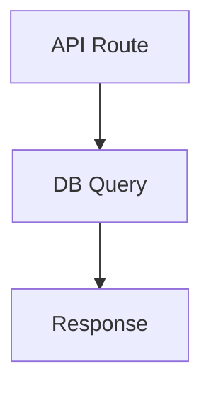

# CodeLax — AI-Powered Code Review Platform
## Complete Project Data for Presentation

---

## 1. PROJECT OVERVIEW

**CodeLax** is a full-stack AI-powered code review platform that automatically reviews pull requests/merge requests using a multi-agent AI pipeline. It supports GitHub, GitLab, and Bitbucket, and includes a VS Code extension for local reviews.

**Live URL:** https://code-lax.vercel.app  
**GitHub Repo:** https://github.com/sou-goog/CodeLax  
**Internship Project** — Built from scratch during Intern 2026

---

## 2. TECH STACK

### Web Application
| Layer | Technology |
|-------|-----------|
| Framework | Next.js 15 (App Router, React 19) |
| Language | TypeScript |
| Styling | TailwindCSS + Radix UI (shadcn/ui components) |
| Database | PostgreSQL (Neon serverless) |
| ORM | Prisma |
| Auth | better-auth (OAuth — GitHub, GitLab) |
| Async Jobs | Inngest (event-driven, step functions) |
| Vector DB | Pinecone (for RAG embeddings) |
| AI Models | Groq (Llama 3.3 70B), OpenRouter (Gemini 2.0), Google Gemini |
| Hosting | Vercel |
| Charts | Recharts |
| Animations | Motion (Framer Motion) |

### VS Code Extension
| Layer | Technology |
|-------|-----------|
| Runtime | VS Code Extension API |
| Language | TypeScript |
| UI | Webview (HTML/CSS/JS) |
| Communication | REST API to CodeLax server |

### External Integrations
- GitHub API (Octokit) — webhooks, PR comments, check runs, labels
- GitLab API — webhooks, MR comments, labels
- Bitbucket API — webhooks, PR comments
- Slack API — critical finding notifications
- Pinecone — vector similarity search for RAG

---

## 3. ARCHITECTURE DIAGRAM

```
┌─────────────────────────────────────────────────────────────────────┐
│                        USER INTERFACES                               │
├──────────────┬──────────────────┬────────────────────────────────────┤
│  Web Dashboard  │  VS Code Extension  │  Git Provider (GitHub/GitLab/BB) │
└──────┬───────┴────────┬─────────┴──────────────┬─────────────────────┘
       │                │                        │
       ▼                ▼                        ▼
┌─────────────────────────────────────────────────────────────────────┐
│                    NEXT.JS API LAYER                                  │
│  • /api/webhooks/github   — PR event handler                         │
│  • /api/webhooks/gitlab   — MR event handler                         │
│  • /api/webhooks/bitbucket — PR event handler                        │
│  • /api/extension/local-review — file/staged changes review          │
│  • /api/inngest — Inngest event bus                                  │
└──────────────────────────────┬──────────────────────────────────────┘
                               │
                               ▼
┌─────────────────────────────────────────────────────────────────────┐
│                    INNGEST (Async Orchestration)                      │
│                                                                       │
│  Event: "pr.review.requested"                                        │
│  Function: generateReviewMultiAgent                                  │
│  Concurrency: 3 | Retries: 2 | onFailure handler                    │
└──────────────────────────────┬──────────────────────────────────────┘
                               │
                               ▼
┌─────────────────────────────────────────────────────────────────────┐
│              MULTI-AGENT AI PIPELINE (8 Steps)                       │
│                                                                       │
│  Step 1: Create pending review record                                │
│  Step 2: Fetch PR data + .codelax.yaml config                        │
│  Step 3: Dedup check (skip if same diffHash)                         │
│  Step 4: Create Check Run (GitHub) — "in_progress"                   │
│  Step 5: Prepare (diff parse, complexity, RAG, Planner)              │
│  Step 6: Run Specialists (Security, Performance, Logic, Style)       │
│  Step 7: Critic verification + Slack notification                    │
│  Step 8: Synthesizer → Post results → Save to DB                     │
└──────────────────────────────┬──────────────────────────────────────┘
                               │
                               ▼
┌─────────────────────────────────────────────────────────────────────┐
│                    OUTPUT (per review)                                │
│  • Summary comment on PR/MR                                          │
│  • Inline comments on specific lines                                 │
│  • Auto-fix suggestions (```suggestion format)                       │
│  • Auto-labels (critical-issues, needs-fix, security-concern, etc.)  │
│  • Check Run status (pass/fail/neutral)                              │
│  • Mermaid architecture diagram                                      │
│  • Complexity score badge (0-100)                                    │
│  • Slack notification (for critical/high severity)                   │
│  • DB record with duration, findings, status                         │
└─────────────────────────────────────────────────────────────────────┘
```

---

## 4. MULTI-AGENT AI PIPELINE (Core Innovation)

### Agent Roles

| Agent | Role | What It Analyzes |
|-------|------|-----------------|
| **Planner** | Orchestrator | Reads the diff, assigns tasks to specialists, determines which agents to activate |
| **Security Agent** | Specialist | SQL injection, XSS, auth bypass, secret leaks, OWASP vulnerabilities |
| **Performance Agent** | Specialist | N+1 queries, memory leaks, unnecessary re-renders, algorithmic complexity |
| **Logic Agent** | Specialist | Race conditions, null pointer risks, edge cases, incorrect business logic |
| **Style Agent** | Specialist | Code style, naming conventions, dead code, documentation gaps |
| **Critic** | Verifier | Cross-validates all specialist findings, removes false positives, assigns confidence scores |
| **Synthesizer** | Writer | Compiles final review with markdown formatting, mermaid diagrams, severity badges |
| **Evaluator** | Quality Gate | Scores the final review (0-100) on traceability, accuracy, suggestions, completeness; triggers regeneration if below threshold |

### Pipeline Flow Diagram
```
PR/MR Opened or Pushed
       │
       ▼
┌─── Planner ───┐         (Light model tier)
│ Reads diff,    │
│ assigns tasks  │
└───┬──┬──┬──┬──┘
    │  │  │  │
    ▼  ▼  ▼  ▼
┌────┐┌────┐┌────┐┌────┐
│Sec ││Perf││Logic││Style│  ← Specialists (Standard tier + language hints)
└──┬─┘└──┬─┘└──┬─┘└──┬─┘
   │     │     │     │
   └─────┴─────┴─────┘
         │
         ▼
  ┌─ Deterministic ─┐
  │ Verifier         │     ← NEW: mechanical check (no LLM)
  │ • File in diff?  │     Rejects hallucinated findings
  │ • Line in hunk?  │     at zero cost before Critic
  │ • Snippet match? │
  └───────┬──────────┘
          │
          ▼
    ┌── Critic ──┐         (Strong model tier)
    │ Verifies   │
    │ findings   │
    │ Scores     │
    │ confidence │
    └─────┬──────┘
          │
          ▼
   ┌─ Synthesizer ─┐      (Strong model tier)
   │ Formats final  │
   │ review with    │
   │ diagrams &     │
   │ badges         │
   └───────┬────────┘
           │
           ▼
   ┌── Evaluator ──┐       ← NEW: review-of-review
   │ Scores quality │      Traceability, Accuracy,
   │ 0-100 score    │      Suggestions, Completeness
   │ Score < 60?    │
   │  → Regenerate  │
   └────────────────┘
```

### How RAG (Retrieval-Augmented Generation) Works
1. When a repo is first connected, files are chunked (4000 chars, 200 overlap)
2. Each chunk is embedded using Google's `gemini-embedding-2` model
3. Embeddings are stored in Pinecone with metadata (repoId, file path)
4. During review, the diff is used to retrieve top-K relevant code chunks
5. This context is provided to specialists so they understand the broader codebase

---

## 5. ALL FEATURES (32 Total)

### Core Review Features
1. **Multi-agent AI review** — 4 specialist agents + critic + synthesizer
2. **Inline review comments** — configurable max count, severity threshold
3. **Auto-fix suggestions** — GitHub ```suggestion format for one-click apply
4. **PR description generator** — AI-generated PR descriptions
5. **Incremental reviews** — only reviews new commits on push (synchronize events)
6. **Smart dedup** — diffHash skips identical diffs already reviewed
7. **File ignore patterns** — .codelax.yaml ignore patterns via glob matching

### Intelligence Features
8. **RAG-powered context** — Pinecone vector search for codebase understanding
9. **Multi-language detection** — auto-detects languages in diff, provides context to agents
10. **PR complexity score** — 0-100 score based on lines, files, patterns
11. **Mermaid diagrams** — architecture visualization in reviews

### Review Quality Features (NEW)
12. **Deterministic pre-filter** — mechanically verifies findings reference real files, lines, and snippets in the diff before LLM Critic; eliminates hallucinations at zero cost
13. **Self-evaluation & regeneration** — Evaluator agent scores final review (0-100) on traceability, accuracy, suggestion quality, completeness; auto-regenerates if score < 60
14. **Role-specific model routing** — Strong tier (Critic/Synthesizer), Standard tier (Specialists), Light tier (Planner) with per-tier fallback chains
15. **Language-specific knowledge injection** — TypeScript, JavaScript, Python, Java, Go, Rust patterns injected into specialist prompts (security, performance, logic)

### Integration Features
16. **GitHub Check Runs** — pass/fail/neutral status directly on PRs
17. **Auto-labels** — critical-issues, needs-fix, security-concern, ai-approved
18. **Slack notifications** — alerts for critical/high severity findings
19. **Multi-provider rotation** — Groq (1-10 keys) → OpenRouter → Gemini with auto-fallback

### Multi-Provider Support
20. **GitHub integration** — full OAuth + webhooks + PR comments + check runs + labels
21. **GitLab integration** — OAuth + webhooks + MR comments + labels
22. **Bitbucket integration** — webhooks + PR comments
23. **Git Provider Abstraction** — unified interface for all providers

### VS Code Extension
24. **Sidebar panel** — view all review findings in VS Code
25. **Review Current File** — instant AI review of the current file
26. **Review Staged Changes** — review git staged diff before committing

### Configuration & Monitoring
27. **.codelax.yaml config** — agents, ignore, minSeverity, maxInlineComments, instructions
28. **Review status tracking** — pending → in_progress → completed/failed/skipped
29. **Duration tracking** — durationMs, startedAt, completedAt
30. **Analytics dashboard** — charts, stats, trends
31. **Re-trigger button** — manually re-run review from UI
32. **Teams support** — team-based repo management with roles

---

## 6. DATABASE SCHEMA

### Models (10 tables)
| Model | Purpose |
|-------|---------|
| `user` | User accounts with extensionApiKey |
| `account` | OAuth provider tokens (GitHub, GitLab) |
| `session` | Active user sessions |
| `repository` | Connected repos (multi-provider: github/gitlab/bitbucket) |
| `review` | AI review records with status, duration, diffHash |
| `review_finding` | Individual findings (severity, file, line, suggestion) |
| `review_rule` | Custom per-repo review rules |
| `team` / `team_member` / `team_invite` | Team collaboration |
| `notification` | In-app notifications |
| `activity_event` | User activity tracking |

### Key Fields
- `repository.provider` — "github" | "gitlab" | "bitbucket"
- `review.status` — "pending" | "in_progress" | "completed" | "failed" | "skipped"
- `review.diffHash` — SHA-256 of diff for dedup
- `review.durationMs` — time taken for the review
- `review_finding.severity` — "critical" | "high" | "medium" | "low"
- `review_finding.confidence` — 0.0 to 1.0 (set by critic agent)

---

## 7. VS CODE EXTENSION

### Commands
| Command | Description |
|---------|-------------|
| `CodeLax: Refresh Reviews` | Refresh sidebar with latest reviews |
| `CodeLax: Configure API Key` | Set API key for authentication |
| `CodeLax: Open in Browser` | Open review in web dashboard |
| `CodeLax: Review Current File` | AI review the active file |
| `CodeLax: Review Staged Changes` | AI review git staged diff |
| `CodeLax: Jump to Finding` | Navigate to a specific finding |

### Features
- Activity bar icon with dedicated sidebar
- Webview showing grouped findings by severity
- Click-to-navigate: clicking a finding jumps to the file/line
- VS Code diagnostics (squiggly underlines) for findings
- Auto-refresh on configurable interval
- Works with any git provider (not just GitHub)
- Local review mode: reviews code without needing a PR

---

## 8. MULTI-PROVIDER ARCHITECTURE

### Git Provider Abstraction (`git-provider.ts`)
```typescript
interface GitProvider {
  fetchPR(owner, repo, prNumber): Promise<PRData>;
  fetchIncrementalDiff(owner, repo, base, head): Promise<string>;
  postComment(owner, repo, prNumber, body): Promise<void>;
  postInlineComments(owner, repo, prNumber, commitSha, comments): Promise<void>;
  addLabels(owner, repo, prNumber, labels): Promise<void>;
  createCheckRun(...): Promise<number | null>;  // GitHub only
  updateCheckRun(...): Promise<void>;           // GitHub only
}
```

### Implementations
- `GitHubProvider` — uses Octokit (full feature set)
- `GitLabProvider` — uses GitLab REST API v4
- `BitbucketProvider` — uses Bitbucket REST API v2.0

### Factory Pattern
```typescript
function createGitProvider(provider: string, token: string): GitProvider
```

---

## 9. MODEL PROVIDER ROTATION (Cost Optimization)

```
Priority Chain:
┌──────────────────────────────────────────┐
│ 1. Groq llama-3.3-70b (keys 1-10)       │  ← Fastest, free tier
│ 2. OpenRouter gemini-2.0-flash-exp:free  │  ← Free fallback
│ 3. Google gemini-2.0-flash-lite          │  ← Final fallback
└──────────────────────────────────────────┘
```

- Supports up to 10 Groq API keys via comma-separated env var or GROQ_API_KEY_2..10
- Auto-detects rate limit (429/quota/TPD errors)
- Exhausted providers are skipped for 1 hour
- Falls back to next provider automatically
- **Result: Essentially free operation** at moderate scale

---

## 10. WEBHOOK FLOW (How Reviews Get Triggered)

### GitHub
1. User opens/pushes to PR
2. GitHub sends POST to `/api/webhooks/github`
3. Server verifies HMAC-SHA256 signature
4. Parses payload (owner, repo, PR#, action)
5. Sends `pr.review.requested` event to Inngest
6. Multi-agent pipeline runs asynchronously
7. Results posted back as PR comment + inline comments

### GitLab
1. User opens/updates MR
2. GitLab sends POST to `/api/webhooks/gitlab`
3. Server verifies X-Gitlab-Token header
4. Parses payload (project path, MR IID, action)
5. Same Inngest event → same pipeline → results on MR

### Bitbucket
1. User creates/updates PR
2. Bitbucket sends POST to `/api/webhooks/bitbucket`
3. Parses payload (full_name, PR ID)
4. Same Inngest event → same pipeline → results on PR

---

## 11. CONFIGURATION (.codelax.yaml)

Users can place a `.codelax.yaml` in their repo root:

```yaml
# Which specialist agents to run
agents:
  - security
  - performance
  - logic
  - style

# Files/patterns to ignore
ignore:
  - "**/*.test.ts"
  - "dist/**"
  - "node_modules/**"
  - "*.lock"

# Minimum severity for inline comments
minSeverity: medium

# Maximum inline comments per review
maxInlineComments: 5

# Custom instructions for agents
instructions: "Focus on TypeScript best practices. Our team uses functional components only."

# Auto-generate PR descriptions
autoDescription: true
```

---

## 12. DASHBOARD PAGES

| Page | Functionality |
|------|---------------|
| `/dashboard` | Overview with stats, recent reviews, activity |
| `/dashboard/repository` | Connect repos (GitHub/GitLab/Bitbucket tabs) |
| `/dashboard/reviews` | All reviews with status badges, duration, filters |
| `/dashboard/reviews/[id]` | Detailed single review with findings |
| `/dashboard/reviews/compare` | Compare two reviews side-by-side |
| `/dashboard/analytics` | Charts: reviews over time, severity distribution |
| `/dashboard/settings` | API key, extension setup, account management |
| `/dashboard/teams` | Team management (invite, roles) |
| `/dashboard/rules` | Custom review rules per repository |
| `/dashboard/webhooks` | Webhook configuration & status |
| `/dashboard/activity` | User activity timeline |
| `/dashboard/config` | Global configuration |
| `/dashboard/onboarding` | First-time setup wizard |

---

## 13. PROJECT STRUCTURE

```
CodeLax/
├── app/                          # Next.js App Router
│   ├── (auth)/
│   │   ├── login/page.tsx        # Login (GitHub + GitLab OAuth)
│   │   └── api/webhooks/
│   │       ├── github/route.ts   # GitHub webhook handler
│   │       ├── gitlab/route.ts   # GitLab webhook handler
│   │       └── bitbucket/route.ts # Bitbucket webhook handler
│   ├── api/
│   │   ├── extension/local-review/route.ts  # Local file/staged review
│   │   └── inngest/route.ts      # Inngest event handler
│   ├── dashboard/                # All dashboard pages
│   └── page.tsx                  # Landing page
│
├── module/
│   ├── ai/
│   │   ├── agents/               # AI agent implementations
│   │   │   ├── planner.ts
│   │   │   ├── security.ts
│   │   │   ├── performance.ts
│   │   │   ├── logic.ts
│   │   │   ├── style.ts
│   │   │   ├── critic.ts
│   │   │   ├── synthesizer.ts
│   │   │   ├── evaluator.ts       # NEW: review quality scorer + regeneration
│   │   │   └── types.ts
│   │   └── lib/
│   │       ├── git-provider.ts    # Multi-provider abstraction
│   │       ├── model-provider.ts  # AI model rotation + role-specific tiers
│   │       ├── finding-verifier.ts # NEW: deterministic pre-filter
│   │       ├── language-hints.ts  # NEW: language-specific patterns
│   │       ├── rag.ts             # RAG pipeline (Pinecone)
│   │       ├── diff-parser.ts     # Diff parsing + complexity
│   │       ├── config.ts          # .codelax.yaml parser
│   │       └── notifications.ts   # Slack integration
│   ├── auth/                     # Auth UI components
│   ├── repository/               # Repo actions & hooks
│   ├── github/                   # GitHub-specific utilities
│   └── settings/                 # Settings components
│
├── inngest/
│   ├── client.ts                 # Inngest client
│   └── functions/
│       └── multi-agent-review.ts # Main pipeline function
│
├── prisma/
│   └── schema.prisma             # Database schema (10 models)
│
├── lib/
│   ├── auth.ts                   # better-auth config (GitHub + GitLab)
│   ├── auth-client.ts            # Client-side auth
│   ├── db.ts                     # Prisma client
│   └── pinecone.ts               # Pinecone client
│
├── codelax-vscode/               # VS Code Extension
│   ├── src/
│   │   ├── extension.ts          # Main extension (commands, activation)
│   │   ├── sidebar.ts            # Webview sidebar provider
│   │   ├── api.ts                # API client for CodeLax server
│   │   ├── diagnostics.ts        # VS Code diagnostics integration
│   │   ├── codelens.ts           # CodeLens integration
│   │   ├── quickfix.ts           # Quick fix code actions
│   │   └── statusbar.ts          # Status bar indicator
│   └── package.json              # Extension manifest
│
└── package.json                  # Root dependencies
```

---

## 14. KEY DIFFERENTIATORS

| Feature | CodeLax | Competitors (CodeRabbit, etc.) |
|---------|---------|-------------------------------|
| Multi-agent architecture | ✅ 4 specialists + critic | Single-pass LLM |
| RAG context | ✅ Pinecone embeddings | Limited context |
| Multi-provider | ✅ GitHub + GitLab + Bitbucket | GitHub only (mostly) |
| Free operation | ✅ Groq free tier rotation | Paid subscription |
| VS Code extension | ✅ Full sidebar + local review | Web only |
| Self-hostable | ✅ Open source, Vercel deploy | SaaS only |
| Check Runs | ✅ Pass/fail on PRs | Comments only |
| Incremental reviews | ✅ Only new commits | Full re-review |
| Hallucination filter | ✅ Deterministic verifier pre-LLM | None |
| Self-evaluation | ✅ Auto-scores & regenerates reviews | No quality check |
| Language-aware | ✅ Per-language patterns (6 languages) | Generic prompts |
| Model routing | ✅ Role-specific tiers (strong/standard/light) | Single model |
| Custom config | ✅ .codelax.yaml | Limited settings |
| Team collaboration | ✅ Teams, roles, invites | Per-user |

---

## 15. SECURITY MEASURES

- **Webhook signature verification** — HMAC-SHA256 for GitHub, token for GitLab
- **OAuth2 authentication** — no passwords stored
- **API key auth** for extension — unique per-user keys
- **No secrets in code** — all via environment variables
- **Cascade auth** — better-auth sessions with CSRF protection
- **DB-level cascade deletes** — removing user removes all associated data

---

## 16. DEPLOYMENT & DEVOPS

- **Vercel** for the Next.js app (auto-deploy from GitHub push)
- **Neon** serverless PostgreSQL (auto-scaling)
- **Pinecone** serverless vector DB
- **Inngest** cloud for async job processing
- **Build pipeline:** `prisma generate → prisma db push → next build`
- **Environment variables:** 15+ env vars managed in Vercel dashboard

---

## 17. HOW EVERYTHING WORKS — DEEP DIVE

This section provides a thorough, end-to-end walkthrough of every component in the CodeLax platform. It explains the internal logic, data flow, and algorithms used at each stage.

---

### 17.1 How a PR Review Works (End-to-End)

When a developer opens a pull request, the following sequence executes automatically:

**Phase 1: Event Ingestion**
1. The git provider (GitHub/GitLab/Bitbucket) fires a webhook to CodeLax's API endpoint.
2. For GitHub, the server verifies the request using HMAC-SHA256 signature (`X-Hub-Signature-256` header) against the stored webhook secret. For GitLab, it checks the `X-Gitlab-Token` header. For Bitbucket, it validates the payload structure.
3. The handler extracts: repository owner, repo name, PR number, action type (opened/synchronize), provider type, and installation token.
4. It then fires an Inngest event: `pr.review.requested` with all this metadata. This decouples the webhook handler (fast, returns 200 immediately) from the heavy AI pipeline (runs async).

**Phase 2: Pipeline Orchestration (Inngest)**
The `generateReviewMultiAgent` function runs as a series of durable steps. Each step is retried independently if it fails, and the entire pipeline has concurrency control (max 3 simultaneous reviews).

**Step 1 — Create Pending Review:**
A database record is created with `status: "pending"`, `startedAt: now()`. This allows the dashboard to show "Pending" badges immediately.

**Step 2 — Fetch PR Data:**
Using the `GitProvider` abstraction (`createGitProvider()`), the pipeline fetches:
- PR title and description
- The raw unified diff (git diff format)
- Head SHA (for posting check runs and inline comments)
- Base/head branch names
It also fetches `.codelax.yaml` config from the repo if it exists.

**Step 3 — Dedup Check:**
The diff is hashed using a fast 32-bit hash (`hashDiff()`). If a completed review with the same `diffHash` already exists for this PR, the pipeline skips and sets `status: "skipped"`. This prevents re-reviewing identical pushes.

**Step 4 — Check Run (GitHub only):**
A GitHub Check Run is created with `status: "in_progress"` using the Checks API. This shows a yellow spinner on the PR. The check run ID is saved for later completion.

**Step 5 — Preparation (The Intelligence Layer):**
This is where the diff gets analyzed and enriched:

- **Diff Parsing & Filtering** (`diff-parser.ts`):
  - The raw diff is split by file using `parseDiffByFile()`.
  - Files matching `SKIP_PATTERNS` (lockfiles, images, build artifacts) are removed.
  - Remaining files are sorted: high-priority source code first, low-priority config last.
  - A character budget (30,000 chars) is applied — if the diff is too large, low-priority files are dropped and large files are truncated.
  - The diff is annotated with real line numbers using `annotateDiffWithLineNumbers()`: each line gets a prefix like `L42+` (new file line 42, added) or `L38-` (old file line 38, deleted). This dramatically reduces agent hallucination of line numbers.

- **Complexity Scoring** (`calculateComplexityScore()`):
  - Computes a 0-100 score based on: file count (0-30pts), total changed lines (0-35pts), hotspot files (0-25pts), refactor signals (+5), wide PR bonus (+5).
  - Hotspot files = source code files (.ts, .py, .go, etc.) with >20 line changes.
  - Output: score, level (trivial/small/moderate/complex/massive), breakdown.

- **RAG Context Retrieval** (`rag.ts`):
  - The diff text is embedded using Google's `gemini-embedding-2` model.
  - This embedding is used to query Pinecone for the top-K most similar code chunks from the indexed codebase.
  - `scaledTopK()` dynamically adjusts K: small diffs get 3 chunks, large diffs get up to 10.
  - Results are deduplicated by file path (keeping highest-scoring chunk per file).
  - These context chunks are prepended to the agent prompts so they understand the broader codebase beyond just the diff.

- **Language Detection:**
  - The Planner examines file extensions in the diff to detect languages (TypeScript, Python, Go, etc.).
  - This list is passed to specialists for language-specific analysis.

- **Planner Agent** (`planner.ts`):
  - Uses the "light" model tier (fast, cheap).
  - Reads the diff + PR title + description.
  - Outputs JSON: `{ agentsToActivate, languages, planNotes, agentFocusHints }`.
  - Decides which specialists to activate (e.g., skip security agent for a CSS-only PR).
  - Provides focus hints per agent (e.g., "Focus on SQL injection in the new query builder").

**Step 6 — Specialist Agents (Parallel Execution):**
All activated specialists run in parallel via `Promise.allSettled()`. Each specialist:

1. Receives: annotated diff, RAG context, PR title, custom instructions, focus hints, DO-NOT rules, and detected languages.
2. Uses the "standard" model tier.
3. Has a specific system prompt defining its expertise (security/performance/logic/style).
4. **Language-Specific Knowledge Injection** (`language-hints.ts`):
   - For each detected language, the agent receives a block of language-specific patterns. For example, the Security agent reviewing TypeScript code receives:
     - "Check for `dangerouslySetInnerHTML` — XSS via unsanitized HTML injection"
     - "Check for `eval()`, `new Function()`, or `vm.runInContext()` — code injection"
     - "Next.js: Server Actions that don't verify session/auth before mutating data"
   - 6 languages are covered: TypeScript, JavaScript, Python, Java, Go, Rust.
   - Each has patterns for security, performance, and logic domains.
5. **DO-NOT Rules:**
   - Rules distilled from past false positives (stored as `RejectionPattern` in the database).
   - Example: "Do not flag optional chaining as a bug if used intentionally for fallback values."
   - These are injected into the system prompt to prevent known false positives from recurring.
6. Outputs a `SpecialistReport`: `{ agentName, findings[], summary, analysisNotes }`.
7. Each finding has: `title, description, severity, confidence, file, line, codeSnippet, suggestion`.

**Step 7 — Deterministic Pre-Filter** (`finding-verifier.ts`):
Before the LLM-powered Critic even sees the findings, a mechanical (zero-cost) verification runs:

- **Check 1: File Exists in Diff** — Normalizes the file path the agent referenced (strips `a/`, `b/` prefixes, normalizes slashes) and checks if it matches any file in the parsed diff. Also tries suffix matching (agent says `auth.ts`, diff has `src/lib/auth.ts`).
- **Check 2: Line Number in Changed Hunk** — Parses the `@@ -oldStart,count +newStart,count @@` headers from the diff. Checks if the referenced line falls within any hunk, with a ±5 line margin for flexibility. Checks both new-file and old-file line ranges.
- **Check 3: Code Snippet Present** — Normalizes the finding's code snippet (lowercase, collapse whitespace, strip punctuation) and checks if it appears in the file's diff content. For multi-line snippets, requires ≥50% of lines to match.

Scoring: If a finding's file isn't in the diff at all → automatic reject. Otherwise, a finding is rejected if it fails 2+ checks. This eliminates hallucinated findings at zero compute cost.

**Step 8 — Critic Agent** (`critic.ts`):
Uses the "strong" model tier.
- Receives: filtered specialist reports + the full diff.
- Cross-validates findings against the diff.
- Deduplicates overlapping findings from different specialists.
- Calibrates severity (downgrades over-hyped findings, upgrades missed critical ones).
- Assigns a confidence score (0.0–1.0) to each verified finding.
- Computes `effectiveScore = severity_weight × confidence` and filters below threshold.
- Assesses overall risk level for the PR.
- Distills rejection patterns from false positives to feed back into future reviews.
- Outputs: `CriticReport` with `verifiedFindings`, `rejectedFindings`, `overallRisk`, `rejectionPatterns`.

**Step 9 — Synthesizer Agent** (`synthesizer.ts`):
Uses the "strong" model tier.
- Takes the Critic's verified findings and produces the final markdown review.
- Includes: summary header, complexity badge, severity table, detailed findings with code suggestions, a Mermaid architecture diagram, "What's Done Well" section, and action items.
- `sanitizeMermaid()` post-processes the diagram to fix common LLM syntax errors (unterminated strings, invalid characters).

**Step 10 — Evaluator Agent** (`evaluator.ts`):
Uses the "strong" model tier (at least as good as the reviewer).
- Receives: the synthesized review, the original diff, and the critic report.
- Scores on 4 dimensions (each 0-10):
  - **Traceability** (weight 3): Are findings backed by real file/line references?
  - **Accuracy** (weight 3): Are findings factually correct?
  - **Suggestion Quality** (weight 2): Are code suggestions syntactically valid?
  - **Completeness** (weight 2): Were obvious issues covered?
- Overall score = weighted average, scaled to 0-100.
- The server recalculates the score from dimension scores to prevent the LLM from gaming it.
- If score < 60: sets `shouldRegenerate = true` with `regenerationHints` explaining what to fix.
- If regeneration is triggered, the Synthesizer re-runs with the evaluator's feedback, but only once (no infinite loops).

**Phase 3: Output Delivery**
- **PR Comment:** The full markdown review is posted as a comment on the PR/MR.
- **Inline Comments:** Individual findings are posted as inline review comments at the specific file/line, with `suggestion` format for one-click apply.
- **Auto-Labels:** Based on findings, labels are applied: `critical-issues`, `needs-fix`, `security-concern`, or `ai-approved` (if no issues found).
- **Check Run Completion:** The GitHub Check Run is updated to pass/fail/neutral based on overall risk.
- **Slack Notification:** If any critical/high findings exist and Slack is configured, an alert is sent.
- **Database:** The review record is updated with `status: "completed"`, the full review text, `completedAt`, `durationMs`, and all findings are stored as `review_finding` records.

---

### 17.2 How RAG (Codebase Indexing & Retrieval) Works

**Indexing Phase (when a repo is first connected):**
1. The codebase files are fetched from the git provider.
2. Each file's content is prepended with its path: `"File: src/utils/auth.ts\n\n<content>"`.
3. The content is chunked using a sliding window: **4000 characters per chunk, 200 character overlap**. The overlap ensures that code at chunk boundaries isn't lost.
4. Each chunk is embedded using Google's `gemini-embedding-2` model (produces a dense vector).
5. Vectors are upserted into Pinecone in batches of 100, with metadata: `{ repoId, path, chunkIndex, totalChunks, content }`.
6. The vector ID format is: `{repoId}-{path_underscored}-chunk{i}`.

**Retrieval Phase (during each review):**
1. The processed diff text is used as the query.
2. The query is embedded using the same `gemini-embedding-2` model.
3. Pinecone is queried with: `{ vector, filter: { repoId }, topK, includeMetadata: true }`.
4. `topK` is dynamically scaled based on diff size: small diffs → 3 chunks, large diffs → up to 10.
5. Results are deduplicated by file path — only the highest-scoring chunk per file is kept.
6. The retrieved chunks are provided to specialists as context, so they understand the broader codebase (function definitions, related files, existing patterns).

---

### 17.3 How the Diff Parser Works

The diff parser (`diff-parser.ts`) is critical infrastructure that sits between raw git diffs and AI agents.

**File Splitting** (`parseDiffByFile`):
- Splits the raw unified diff on `diff --git` boundaries.
- Extracts the filename from each chunk's `a/path b/path` header.
- Filters out noise files (lockfiles, images, build artifacts, `node_modules/`, etc.) via regex patterns.
- Counts additions/deletions per file.

**Budget-Aware Filtering** (`prepareDiffForAgents`):
- Sorts files: source code files first (high priority), config files last (low priority).
- Within same priority tier, files with more changes are ranked higher.
- Applies a 30,000 character budget. Files that exceed the remaining budget are truncated or excluded.
- Returns a summary of which files were included vs. excluded.

**Line Number Annotation** (`annotateDiffWithLineNumbers`):
- Parses hunk headers (`@@ -old,count +new,count @@`) to track real line numbers.
- Rewrites each diff line with its actual file line number:
  - `+const x = 1` becomes `L42+ const x = 1` (line 42 in new file, added)
  - `-old_var = 2` becomes `L38- old_var = 2` (line 38 in old file, deleted)
  - Context lines get `L42  unchanged_line` (present in both)
- This eliminates a major source of agent hallucination: without annotation, agents guess line numbers from the hunk position, which is often wrong.

**Custom Ignore Patterns:**
- Users can define glob patterns in `.codelax.yaml` under `ignore`.
- The `matchGlob()` function converts globs to regex: `*` matches non-slash chars, `**` matches any path segment.
- Ignored files are filtered out during `parseDiffByFile`.

---

### 17.4 How Model Provider Rotation Works

The model provider (`model-provider.ts`) implements a multi-tier, multi-provider fallback system that enables CodeLax to operate at zero cost.

**Provider Chain Architecture:**
- At startup, `buildProviderChain()` scans environment variables and builds three ordered chains:
  - **Strong tier:** Groq 70B (all keys) → OpenRouter Gemini → (fallback)
  - **Standard tier:** Groq 70B (all keys) → OpenRouter Gemini → Google Gemini Flash → (fallback)
  - **Light tier:** Groq 70B (all keys) → Google Gemini Lite → (fallback)
- Each tier always has at least one provider (filled from other tiers if necessary).

**Role → Tier Mapping:**
| Agent Role | Tier | Reasoning |
|-----------|------|-----------|
| Planner | Light | Small JSON output, simple task |
| Security/Performance/Logic/Style | Standard | Bulk analysis, balanced quality/speed |
| Critic | Strong | Must accurately verify findings against diff |
| Synthesizer | Strong | Must produce well-formatted, coherent review |
| Evaluator | Strong | Must catch quality issues the reviewer missed |

**Automatic Fallback:**
- `generateTextWithFallback()` tries each provider in the chain sequentially.
- If a provider returns a rate limit error (429, quota exceeded, TPD limit, RESOURCE_EXHAUSTED), it is:
  1. Marked as "exhausted" for 1 hour (stored in an in-memory `Map<name, expiryTimestamp>`).
  2. Skipped on subsequent calls until the expiry.
  3. The next provider is tried immediately.
- Non-rate-limit errors (network, parsing) also trigger fallback but don't mark the provider as exhausted.
- If all providers are exhausted, it retries the first one (it may have reset).

**Cost:** With up to 10 Groq free-tier keys × 100K tokens/day each, plus OpenRouter free models and Google free tier, CodeLax can process dozens of reviews daily at zero cost.

---

### 17.5 How the VS Code Extension Works

The extension (`codelax-vscode/`) provides a complete in-editor review experience.

**Architecture:**
- `extension.ts` — Main entry point. Registers commands, activates sidebar, initializes diagnostics.
- `api.ts` — HTTP client for the CodeLax server. Handles auth (Bearer token), request/response.
- `sidebar.ts` — Webview provider that renders the sidebar panel using raw HTML/CSS/JS.
- `diagnostics.ts` — Maps findings to VS Code diagnostics (squiggly underlines with severity colors).
- `codelens.ts` — Shows inline annotations above affected lines with severity icons.
- `statusbar.ts` — Shows a summary in the status bar: "CodeLax: 2🔴 3🟡 1🟢".
- `quickfix.ts` — Provides quick-fix code actions for findings.

**Review Flow (local file):**
1. User opens a code file and runs "CodeLax: Review Current File".
2. The extension reads the file content and detects the language from the file extension.
3. It sends a POST to `/api/extension/local-review` with `{ code, fileName, language, title }`.
4. The server wraps the code in a pseudo-diff format: `--- a/file\n+++ b/file\n@@ ... @@\n+line1\n+line2`.
5. The full pipeline runs: Planner → Specialists (with language hints) → Critic → Response.
6. The extension receives findings and: updates the sidebar, creates diagnostics, refreshes CodeLens, updates status bar.

**Review Flow (staged changes):**
1. User stages files with `git add` and runs "CodeLax: Review Staged Changes".
2. The extension runs `git diff --staged` to get the real unified diff.
3. It sends a POST to `/api/extension/local-review` with `{ diff, title }`.
4. The same pipeline runs, but this time the **deterministic verifier also runs** (since it's a real diff).
5. Results are displayed in the sidebar with the header "Staged Changes" and findings mapped to real file/line locations.

**Sidebar UI:**
- Built as a Webview (HTML rendered via `getWebviewContent()` function).
- Shows findings grouped by file, with severity badges (CRITICAL/HIGH/MEDIUM/LOW).
- Click a finding → jumps to the file and line in the editor.
- Has buttons for: File review, Staged review, Selection review, Refresh.
- Shows review metadata: agent name, line number, completion status.

---

### 17.6 How the Deterministic Verifier Works (Hallucination Prevention)

The verifier (`finding-verifier.ts`) is a mechanical (non-LLM) filter that runs before the Critic. Its purpose is to eliminate hallucinated findings at zero compute cost.

**Why it exists:** LLM agents sometimes "hallucinate" findings — referencing files that don't exist in the diff, citing incorrect line numbers, or quoting code snippets that aren't in the changed code. The Critic agent catches some of these, but it's itself an LLM and can miss them. The deterministic verifier catches them with 100% reliability.

**Three Mechanical Checks:**

1. **File Existence Check:**
   - Normalizes the finding's file path: strips `a/`, `b/` prefixes, normalizes `\` to `/`, lowercases.
   - Looks up the normalized path in the parsed diff's file map.
   - If exact match fails, tries **suffix matching**: if the agent says `auth.ts` and the diff has `src/lib/auth.ts`, it matches.
   - If no match at all → `FILE_NOT_IN_DIFF` (automatic reject).

2. **Line Number in Hunk Check:**
   - Parses `@@ -oldStart,count +newStart,count @@` headers from the file's diff.
   - Checks if the finding's line number falls within any hunk range, with a **±5 line margin** (agents sometimes reference the line just above/below the actual change).
   - Checks both new-file and old-file line ranges.
   - If no match → `LINE_NOT_IN_HUNK`.

3. **Code Snippet Presence Check:**
   - Normalizes the finding's `codeSnippet`: lowercase, collapse whitespace, strip punctuation (`'";\`;{}()[]`).
   - Normalizes the file's diff content the same way.
   - Checks for direct substring match.
   - If that fails, splits the snippet into lines and checks if ≥50% of lines match individually.
   - Snippets shorter than 5 characters are auto-passed (too short to verify).
   - If no match → `SNIPPET_NOT_FOUND`.

**Scoring Logic:**
- If `FILE_NOT_IN_DIFF` → **automatic reject** (the finding is certainly hallucinated).
- Otherwise, a finding is rejected if it fails **2 or more checks**.
- A finding with only 1 minor failure passes (allows for small agent imprecisions).

**When it runs:**
- For real git diffs (PR reviews, staged changes) → always runs.
- For raw code reviews (single file) → skipped (pseudo-diff paths don't match agent output).

---

### 17.7 How the Evaluator (Self-Review) Works

The Evaluator (`evaluator.ts`) is a "review-of-review" agent that scores the quality of the final AI-generated review and can trigger regeneration.

**Process:**
1. Receives: the synthesized markdown review, the original diff, the critic report, and the PR title.
2. Uses the "strong" model tier (at least as capable as the agents that produced the review).
3. Scores 4 dimensions (0-10 each):
   - **Traceability (×3 weight):** Every finding should reference a real file and line from the diff.
   - **Accuracy (×3 weight):** Findings should be factually correct, not hallucinations.
   - **Suggestion Quality (×2 weight):** Code suggestions should be syntactically valid and actually fix the issue.
   - **Completeness (×2 weight):** Obvious bugs in the diff should not be missed.
4. Computes overall score: `(trace×3 + accuracy×3 + suggest×2 + complete×2) / 10 × 10`.
5. **Server-side recalculation:** The score is recomputed from the dimension scores rather than trusting the LLM's self-reported overall score. This prevents gaming.

**Regeneration Logic:**
- Quality threshold: 60/100.
- If `score < 60`: the Evaluator returns `shouldRegenerate: true` with `regenerationHints` (specific feedback like "Finding #2 references line 45 but the change is on line 52").
- The pipeline reruns the Synthesizer with the evaluator's feedback appended to the prompt.
- Maximum 1 regeneration attempt (prevents infinite loops).

---

### 17.8 How Language-Specific Knowledge Injection Works

Instead of fine-tuning separate models per language, CodeLax injects curated language-specific patterns directly into specialist agent prompts (`language-hints.ts`).

**Coverage:** 6 languages × 3 domains = 18 pattern sets:
| Language | Security Patterns | Performance Patterns | Logic Patterns |
|----------|------------------|---------------------|----------------|
| TypeScript | `dangerouslySetInnerHTML`, `eval()`, raw SQL, missing zod validation, `any` casts on auth | `await` in loops, missing `useMemo`, unbounded `findMany`, sync `fs` | `==` vs `===`, optional chaining swallowing errors, missing useEffect deps |
| JavaScript | Prototype pollution, `innerHTML` without DOMPurify, `require(userInput)` | Uncached `querySelectorAll`, event listener leaks, `filter().map()` chains | Same as TS subset |
| Python | `os.system()`, `pickle.loads()`, SQL f-strings, `yaml.load()` without SafeLoader | List comprehension vs generators, string `+` in loops, N+1 Django queries | Mutable default args, bare `except: pass`, `is` vs `==` |
| Java | `Statement.execute(sql)`, `Runtime.exec()`, XXE, insecure deserialization | String concatenation in loops, coarse `synchronized`, missing `@Transactional` | `==` on String, `ConcurrentModificationException`, `Integer.parseInt` without try-catch |
| Go | `fmt.Sprintf` in SQL, unchecked errors, goroutine leaks | `append()` without pre-allocation, `sync.Mutex` vs `sync.RWMutex` | Nil pointer, goroutine data races, `defer` in loops |
| Rust | `unsafe` blocks, `.unwrap()` in prod, `format!()` in SQL | `.clone()` where borrow suffices, `Vec` in loops, `Box<dyn Trait>` vs generics | `match` missing arms, integer overflow, lifetime issues |

**How it works:**
1. The Planner detects languages from file extensions in the diff.
2. `getLanguageHints(agentName, languages)` is called for each specialist.
3. It looks up the agent's domain (security/performance/logic) and the languages.
4. Returns a formatted block injected into the system prompt: patterns to check + framework-specific hints.
5. Aliases are handled: `ts` → `typescript`, `py` → `python`, `tsx` → `typescript`, `kotlin` → `java` (JVM overlap).

---

## 18. METRICS & NUMBERS

- **10** database models
- **8** AI agents in the pipeline (Planner, 4 Specialists, Critic, Synthesizer, Evaluator)
- **3** git providers supported (GitHub, GitLab, Bitbucket)
- **32** features
- **17** dashboard pages
- **6** VS Code commands
- **3** AI model providers with auto-rotation (Groq, OpenRouter, Google)
- **3** model tiers (Strong, Standard, Light) with role-based routing
- **Up to 10** Groq API keys for throughput
- **10** step pipeline with status tracking
- **6** languages with curated pattern sets (TS, JS, Python, Java, Go, Rust)
- **3** deterministic verification checks (file, line, snippet)
- **Concurrency 3** — reviews 3 PRs simultaneously
- **0 cost** — operates entirely on free-tier AI APIs

---

## 19. FUTURE ROADMAP (if asked)

- GitHub App (instead of personal tokens) for org-wide installation
- Self-hosted LLM support (Ollama)
- PR auto-merge on ai-approved
- Custom agent creation (user-defined specialists)
- Review analytics ML (predict bug-prone files)
- Mobile app for review notifications
- Monorepo support (per-package configs)

---

## 20. SAMPLE OUTPUT (What a review looks like)

```markdown
## 🔍 CodeLax AI Review

**Complexity:** 🟡 42/100 (Moderate)

### Findings Summary
| Severity | Count |
|----------|-------|
| 🔴 Critical | 1 |
| 🟠 High | 2 |
| 🟡 Medium | 3 |
| 🟢 Low | 1 |

### 🔴 Critical: SQL Injection in user query
**File:** `src/db/users.ts:45`  
**Agent:** Security  
**Confidence:** 0.95

The raw user input is interpolated directly into the SQL query...

```suggestion
const result = await db.query('SELECT * FROM users WHERE id = $1', [userId]);
```

### Architecture Diagram


---
*Review completed in 12.4s | 7 findings | Risk: HIGH*
```

---

## 21. HOW TO DEMO (Quick Steps)

1. **Show login page** → GitHub + GitLab buttons
2. **Connect a repo** → show provider tabs (GitHub/GitLab/Bitbucket)
3. **Open a PR** on the connected repo
4. **Wait ~15-30 seconds** → review appears as PR comment
5. **Show dashboard** → review with status badges, findings
6. **Show VS Code extension** → sidebar with findings, click to navigate
7. **Demo local review** → "Review Current File" command
8. **Show analytics** → charts and trends

---

*Generated for presentation preparation. This document contains the complete technical and feature overview of the CodeLax platform.*
