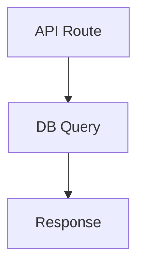

# CodeLax — AI-Powered Code Review Platform
## Complete Project Data for Presentation

---

## 1. PROJECT OVERVIEW

**CodeLax** is a full-stack AI-powered code review platform that automatically reviews pull requests/merge requests using a multi-agent AI pipeline. It supports GitHub, GitLab, and Bitbucket, and includes a VS Code extension for local reviews.

**Live URL:** https://code-lax.vercel.app  
**GitHub Repo:** https://github.com/sou-goog/CodeLax  
**Internship Project** — Built from scratch during Intern 2026

---

## 2. TECH STACK

### Web Application
| Layer | Technology |
|-------|-----------|
| Framework | Next.js 15 (App Router, React 19) |
| Language | TypeScript |
| Styling | TailwindCSS + Radix UI (shadcn/ui components) |
| Database | PostgreSQL (Neon serverless) |
| ORM | Prisma |
| Auth | better-auth (OAuth — GitHub, GitLab) |
| Async Jobs | Inngest (event-driven, step functions) |
| Vector DB | Pinecone (for RAG embeddings) |
| AI Models | Groq (Llama 3.3 70B), OpenRouter (Gemini 2.0), Google Gemini |
| Hosting | Vercel |
| Charts | Recharts |
| Animations | Motion (Framer Motion) |

### VS Code Extension
| Layer | Technology |
|-------|-----------|
| Runtime | VS Code Extension API |
| Language | TypeScript |
| UI | Webview (HTML/CSS/JS) |
| Communication | REST API to CodeLax server |

### External Integrations
- GitHub API (Octokit) — webhooks, PR comments, check runs, labels
- GitLab API — webhooks, MR comments, labels
- Bitbucket API — webhooks, PR comments
- Slack API — critical finding notifications
- Pinecone — vector similarity search for RAG

---

## 3. ARCHITECTURE DIAGRAM

```
┌─────────────────────────────────────────────────────────────────────┐
│                        USER INTERFACES                               │
├──────────────┬──────────────────┬────────────────────────────────────┤
│  Web Dashboard  │  VS Code Extension  │  Git Provider (GitHub/GitLab/BB) │
└──────┬───────┴────────┬─────────┴──────────────┬─────────────────────┘
       │                │                        │
       ▼                ▼                        ▼
┌─────────────────────────────────────────────────────────────────────┐
│                    NEXT.JS API LAYER                                  │
│  • /api/webhooks/github   — PR event handler                         │
│  • /api/webhooks/gitlab   — MR event handler                         │
│  • /api/webhooks/bitbucket — PR event handler                        │
│  • /api/extension/local-review — file/staged changes review          │
│  • /api/inngest — Inngest event bus                                  │
└──────────────────────────────┬──────────────────────────────────────┘
                               │
                               ▼
┌─────────────────────────────────────────────────────────────────────┐
│                    INNGEST (Async Orchestration)                      │
│                                                                       │
│  Event: "pr.review.requested"                                        │
│  Function: generateReviewMultiAgent                                  │
│  Concurrency: 3 | Retries: 2 | onFailure handler                    │
└──────────────────────────────┬──────────────────────────────────────┘
                               │
                               ▼
┌─────────────────────────────────────────────────────────────────────┐
│              MULTI-AGENT AI PIPELINE (8 Steps)                       │
│                                                                       │
│  Step 1: Create pending review record                                │
│  Step 2: Fetch PR data + .codelax.yaml config                        │
│  Step 3: Dedup check (skip if same diffHash)                         │
│  Step 4: Create Check Run (GitHub) — "in_progress"                   │
│  Step 5: Prepare (diff parse, complexity, RAG, Planner)              │
│  Step 6: Run Specialists (Security, Performance, Logic, Style)       │
│  Step 7: Critic verification + Slack notification                    │
│  Step 8: Synthesizer → Post results → Save to DB                     │
└──────────────────────────────┬──────────────────────────────────────┘
                               │
                               ▼
┌─────────────────────────────────────────────────────────────────────┐
│                    OUTPUT (per review)                                │
│  • Summary comment on PR/MR                                          │
│  • Inline comments on specific lines                                 │
│  • Auto-fix suggestions (```suggestion format)                       │
│  • Auto-labels (critical-issues, needs-fix, security-concern, etc.)  │
│  • Check Run status (pass/fail/neutral)                              │
│  • Mermaid architecture diagram                                      │
│  • Complexity score badge (0-100)                                    │
│  • Slack notification (for critical/high severity)                   │
│  • DB record with duration, findings, status                         │
└─────────────────────────────────────────────────────────────────────┘
```

---

## 4. MULTI-AGENT AI PIPELINE (Core Innovation)

### Agent Roles

| Agent | Role | What It Analyzes |
|-------|------|-----------------|
| **Planner** | Orchestrator | Reads the diff, assigns tasks to specialists, determines which agents to activate |
| **Security Agent** | Specialist | SQL injection, XSS, auth bypass, secret leaks, OWASP vulnerabilities |
| **Performance Agent** | Specialist | N+1 queries, memory leaks, unnecessary re-renders, algorithmic complexity |
| **Logic Agent** | Specialist | Race conditions, null pointer risks, edge cases, incorrect business logic |
| **Style Agent** | Specialist | Code style, naming conventions, dead code, documentation gaps |
| **Critic** | Verifier | Cross-validates all specialist findings, removes false positives, assigns confidence scores |
| **Synthesizer** | Writer | Compiles final review with markdown formatting, mermaid diagrams, severity badges |

### Pipeline Flow Diagram
```
PR/MR Opened or Pushed
       │
       ▼
┌─── Planner ───┐
│ Reads diff,    │
│ assigns tasks  │
└───┬──┬──┬──┬──┘
    │  │  │  │
    ▼  ▼  ▼  ▼
┌────┐┌────┐┌────┐┌────┐
│Sec ││Perf││Logic││Style│  ← Specialists (run in parallel)
└──┬─┘└──┬─┘└──┬─┘└──┬─┘
   │     │     │     │
   └─────┴─────┴─────┘
         │
         ▼
    ┌── Critic ──┐
    │ Verifies   │
    │ findings   │
    │ Scores     │
    │ confidence │
    └─────┬──────┘
          │
          ▼
   ┌─ Synthesizer ─┐
   │ Formats final  │
   │ review with    │
   │ diagrams &     │
   │ badges         │
   └────────────────┘
```

### How RAG (Retrieval-Augmented Generation) Works
1. When a repo is first connected, files are chunked (4000 chars, 200 overlap)
2. Each chunk is embedded using Google's `gemini-embedding-2` model
3. Embeddings are stored in Pinecone with metadata (repoId, file path)
4. During review, the diff is used to retrieve top-K relevant code chunks
5. This context is provided to specialists so they understand the broader codebase

---

## 5. ALL FEATURES (22 Total)

### Core Review Features
1. **Multi-agent AI review** — 4 specialist agents + critic + synthesizer
2. **Inline review comments** — configurable max count, severity threshold
3. **Auto-fix suggestions** — GitHub ```suggestion format for one-click apply
4. **PR description generator** — AI-generated PR descriptions
5. **Incremental reviews** — only reviews new commits on push (synchronize events)
6. **Smart dedup** — diffHash skips identical diffs already reviewed
7. **File ignore patterns** — .codelax.yaml ignore patterns via glob matching

### Intelligence Features
8. **RAG-powered context** — Pinecone vector search for codebase understanding
9. **Multi-language detection** — auto-detects languages in diff, provides context to agents
10. **PR complexity score** — 0-100 score based on lines, files, patterns
11. **Mermaid diagrams** — architecture visualization in reviews

### Integration Features
12. **GitHub Check Runs** — pass/fail/neutral status directly on PRs
13. **Auto-labels** — critical-issues, needs-fix, security-concern, ai-approved
14. **Slack notifications** — alerts for critical/high severity findings
15. **Multi-provider rotation** — Groq (1-10 keys) → OpenRouter → Gemini with auto-fallback

### Multi-Provider Support
16. **GitHub integration** — full OAuth + webhooks + PR comments + check runs + labels
17. **GitLab integration** — OAuth + webhooks + MR comments + labels
18. **Bitbucket integration** — webhooks + PR comments
19. **Git Provider Abstraction** — unified interface for all providers

### VS Code Extension
20. **Sidebar panel** — view all review findings in VS Code
21. **Review Current File** — instant AI review of the current file
22. **Review Staged Changes** — review git staged diff before committing

### Configuration & Monitoring
23. **.codelax.yaml config** — agents, ignore, minSeverity, maxInlineComments, instructions
24. **Review status tracking** — pending → in_progress → completed/failed/skipped
25. **Duration tracking** — durationMs, startedAt, completedAt
26. **Analytics dashboard** — charts, stats, trends
27. **Re-trigger button** — manually re-run review from UI
28. **Teams support** — team-based repo management with roles

---

## 6. DATABASE SCHEMA

### Models (10 tables)
| Model | Purpose |
|-------|---------|
| `user` | User accounts with extensionApiKey |
| `account` | OAuth provider tokens (GitHub, GitLab) |
| `session` | Active user sessions |
| `repository` | Connected repos (multi-provider: github/gitlab/bitbucket) |
| `review` | AI review records with status, duration, diffHash |
| `review_finding` | Individual findings (severity, file, line, suggestion) |
| `review_rule` | Custom per-repo review rules |
| `team` / `team_member` / `team_invite` | Team collaboration |
| `notification` | In-app notifications |
| `activity_event` | User activity tracking |

### Key Fields
- `repository.provider` — "github" | "gitlab" | "bitbucket"
- `review.status` — "pending" | "in_progress" | "completed" | "failed" | "skipped"
- `review.diffHash` — SHA-256 of diff for dedup
- `review.durationMs` — time taken for the review
- `review_finding.severity` — "critical" | "high" | "medium" | "low"
- `review_finding.confidence` — 0.0 to 1.0 (set by critic agent)

---

## 7. VS CODE EXTENSION

### Commands
| Command | Description |
|---------|-------------|
| `CodeLax: Refresh Reviews` | Refresh sidebar with latest reviews |
| `CodeLax: Configure API Key` | Set API key for authentication |
| `CodeLax: Open in Browser` | Open review in web dashboard |
| `CodeLax: Review Current File` | AI review the active file |
| `CodeLax: Review Staged Changes` | AI review git staged diff |
| `CodeLax: Jump to Finding` | Navigate to a specific finding |

### Features
- Activity bar icon with dedicated sidebar
- Webview showing grouped findings by severity
- Click-to-navigate: clicking a finding jumps to the file/line
- VS Code diagnostics (squiggly underlines) for findings
- Auto-refresh on configurable interval
- Works with any git provider (not just GitHub)
- Local review mode: reviews code without needing a PR

---

## 8. MULTI-PROVIDER ARCHITECTURE

### Git Provider Abstraction (`git-provider.ts`)
```typescript
interface GitProvider {
  fetchPR(owner, repo, prNumber): Promise<PRData>;
  fetchIncrementalDiff(owner, repo, base, head): Promise<string>;
  postComment(owner, repo, prNumber, body): Promise<void>;
  postInlineComments(owner, repo, prNumber, commitSha, comments): Promise<void>;
  addLabels(owner, repo, prNumber, labels): Promise<void>;
  createCheckRun(...): Promise<number | null>;  // GitHub only
  updateCheckRun(...): Promise<void>;           // GitHub only
}
```

### Implementations
- `GitHubProvider` — uses Octokit (full feature set)
- `GitLabProvider` — uses GitLab REST API v4
- `BitbucketProvider` — uses Bitbucket REST API v2.0

### Factory Pattern
```typescript
function createGitProvider(provider: string, token: string): GitProvider
```

---

## 9. MODEL PROVIDER ROTATION (Cost Optimization)

```
Priority Chain:
┌──────────────────────────────────────────┐
│ 1. Groq llama-3.3-70b (keys 1-10)       │  ← Fastest, free tier
│ 2. OpenRouter gemini-2.0-flash-exp:free  │  ← Free fallback
│ 3. Google gemini-2.0-flash-lite          │  ← Final fallback
└──────────────────────────────────────────┘
```

- Supports up to 10 Groq API keys via comma-separated env var or GROQ_API_KEY_2..10
- Auto-detects rate limit (429/quota/TPD errors)
- Exhausted providers are skipped for 1 hour
- Falls back to next provider automatically
- **Result: Essentially free operation** at moderate scale

---

## 10. WEBHOOK FLOW (How Reviews Get Triggered)

### GitHub
1. User opens/pushes to PR
2. GitHub sends POST to `/api/webhooks/github`
3. Server verifies HMAC-SHA256 signature
4. Parses payload (owner, repo, PR#, action)
5. Sends `pr.review.requested` event to Inngest
6. Multi-agent pipeline runs asynchronously
7. Results posted back as PR comment + inline comments

### GitLab
1. User opens/updates MR
2. GitLab sends POST to `/api/webhooks/gitlab`
3. Server verifies X-Gitlab-Token header
4. Parses payload (project path, MR IID, action)
5. Same Inngest event → same pipeline → results on MR

### Bitbucket
1. User creates/updates PR
2. Bitbucket sends POST to `/api/webhooks/bitbucket`
3. Parses payload (full_name, PR ID)
4. Same Inngest event → same pipeline → results on PR

---

## 11. CONFIGURATION (.codelax.yaml)

Users can place a `.codelax.yaml` in their repo root:

```yaml
# Which specialist agents to run
agents:
  - security
  - performance
  - logic
  - style

# Files/patterns to ignore
ignore:
  - "**/*.test.ts"
  - "dist/**"
  - "node_modules/**"
  - "*.lock"

# Minimum severity for inline comments
minSeverity: medium

# Maximum inline comments per review
maxInlineComments: 5

# Custom instructions for agents
instructions: "Focus on TypeScript best practices. Our team uses functional components only."

# Auto-generate PR descriptions
autoDescription: true
```

---

## 12. DASHBOARD PAGES

| Page | Functionality |
|------|---------------|
| `/dashboard` | Overview with stats, recent reviews, activity |
| `/dashboard/repository` | Connect repos (GitHub/GitLab/Bitbucket tabs) |
| `/dashboard/reviews` | All reviews with status badges, duration, filters |
| `/dashboard/reviews/[id]` | Detailed single review with findings |
| `/dashboard/reviews/compare` | Compare two reviews side-by-side |
| `/dashboard/analytics` | Charts: reviews over time, severity distribution |
| `/dashboard/settings` | API key, extension setup, account management |
| `/dashboard/teams` | Team management (invite, roles) |
| `/dashboard/rules` | Custom review rules per repository |
| `/dashboard/webhooks` | Webhook configuration & status |
| `/dashboard/activity` | User activity timeline |
| `/dashboard/config` | Global configuration |
| `/dashboard/onboarding` | First-time setup wizard |

---

## 13. PROJECT STRUCTURE

```
CodeLax/
├── app/                          # Next.js App Router
│   ├── (auth)/
│   │   ├── login/page.tsx        # Login (GitHub + GitLab OAuth)
│   │   └── api/webhooks/
│   │       ├── github/route.ts   # GitHub webhook handler
│   │       ├── gitlab/route.ts   # GitLab webhook handler
│   │       └── bitbucket/route.ts # Bitbucket webhook handler
│   ├── api/
│   │   ├── extension/local-review/route.ts  # Local file/staged review
│   │   └── inngest/route.ts      # Inngest event handler
│   ├── dashboard/                # All dashboard pages
│   └── page.tsx                  # Landing page
│
├── module/
│   ├── ai/
│   │   ├── agents/               # AI agent implementations
│   │   │   ├── planner.ts
│   │   │   ├── security.ts
│   │   │   ├── performance.ts
│   │   │   ├── logic.ts
│   │   │   ├── style.ts
│   │   │   ├── critic.ts
│   │   │   ├── synthesizer.ts
│   │   │   └── types.ts
│   │   └── lib/
│   │       ├── git-provider.ts   # Multi-provider abstraction
│   │       ├── model-provider.ts # AI model rotation
│   │       ├── rag.ts            # RAG pipeline (Pinecone)
│   │       ├── diff-parser.ts    # Diff parsing + complexity
│   │       ├── config.ts         # .codelax.yaml parser
│   │       └── notifications.ts  # Slack integration
│   ├── auth/                     # Auth UI components
│   ├── repository/               # Repo actions & hooks
│   ├── github/                   # GitHub-specific utilities
│   └── settings/                 # Settings components
│
├── inngest/
│   ├── client.ts                 # Inngest client
│   └── functions/
│       └── multi-agent-review.ts # Main pipeline function
│
├── prisma/
│   └── schema.prisma             # Database schema (10 models)
│
├── lib/
│   ├── auth.ts                   # better-auth config (GitHub + GitLab)
│   ├── auth-client.ts            # Client-side auth
│   ├── db.ts                     # Prisma client
│   └── pinecone.ts               # Pinecone client
│
├── codelax-vscode/               # VS Code Extension
│   ├── src/
│   │   ├── extension.ts          # Main extension (commands, activation)
│   │   ├── sidebar.ts            # Webview sidebar provider
│   │   ├── api.ts                # API client for CodeLax server
│   │   ├── diagnostics.ts        # VS Code diagnostics integration
│   │   ├── codelens.ts           # CodeLens integration
│   │   └── statusbar.ts          # Status bar indicator
│   └── package.json              # Extension manifest
│
└── package.json                  # Root dependencies
```

---

## 14. KEY DIFFERENTIATORS

| Feature | CodeLax | Competitors (CodeRabbit, etc.) |
|---------|---------|-------------------------------|
| Multi-agent architecture | ✅ 4 specialists + critic | Single-pass LLM |
| RAG context | ✅ Pinecone embeddings | Limited context |
| Multi-provider | ✅ GitHub + GitLab + Bitbucket | GitHub only (mostly) |
| Free operation | ✅ Groq free tier rotation | Paid subscription |
| VS Code extension | ✅ Full sidebar + local review | Web only |
| Self-hostable | ✅ Open source, Vercel deploy | SaaS only |
| Check Runs | ✅ Pass/fail on PRs | Comments only |
| Incremental reviews | ✅ Only new commits | Full re-review |
| Custom config | ✅ .codelax.yaml | Limited settings |
| Team collaboration | ✅ Teams, roles, invites | Per-user |

---

## 15. SECURITY MEASURES

- **Webhook signature verification** — HMAC-SHA256 for GitHub, token for GitLab
- **OAuth2 authentication** — no passwords stored
- **API key auth** for extension — unique per-user keys
- **No secrets in code** — all via environment variables
- **Cascade auth** — better-auth sessions with CSRF protection
- **DB-level cascade deletes** — removing user removes all associated data

---

## 16. DEPLOYMENT & DEVOPS

- **Vercel** for the Next.js app (auto-deploy from GitHub push)
- **Neon** serverless PostgreSQL (auto-scaling)
- **Pinecone** serverless vector DB
- **Inngest** cloud for async job processing
- **Build pipeline:** `prisma generate → prisma db push → next build`
- **Environment variables:** 15+ env vars managed in Vercel dashboard

---

## 17. METRICS & NUMBERS

- **10** database models
- **7** AI agents in the pipeline
- **3** git providers supported
- **22+** features
- **17** dashboard pages
- **6** VS Code commands
- **3** AI model providers with auto-rotation
- **Up to 10** Groq API keys for throughput
- **8** step pipeline with status tracking
- **Concurrency 3** — reviews 3 PRs simultaneously

---

## 18. FUTURE ROADMAP (if asked)

- GitHub App (instead of personal tokens) for org-wide installation
- Self-hosted LLM support (Ollama)
- PR auto-merge on ai-approved
- Custom agent creation (user-defined specialists)
- Review analytics ML (predict bug-prone files)
- Mobile app for review notifications
- Monorepo support (per-package configs)

---

## 19. SAMPLE OUTPUT (What a review looks like)

```markdown
## 🔍 CodeLax AI Review

**Complexity:** 🟡 42/100 (Moderate)

### Findings Summary
| Severity | Count |
|----------|-------|
| 🔴 Critical | 1 |
| 🟠 High | 2 |
| 🟡 Medium | 3 |
| 🟢 Low | 1 |

### 🔴 Critical: SQL Injection in user query
**File:** `src/db/users.ts:45`  
**Agent:** Security  
**Confidence:** 0.95

The raw user input is interpolated directly into the SQL query...

```suggestion
const result = await db.query('SELECT * FROM users WHERE id = $1', [userId]);
```

### Architecture Diagram


---
*Review completed in 12.4s | 7 findings | Risk: HIGH*
```

---

## 20. HOW TO DEMO (Quick Steps)

1. **Show login page** → GitHub + GitLab buttons
2. **Connect a repo** → show provider tabs (GitHub/GitLab/Bitbucket)
3. **Open a PR** on the connected repo
4. **Wait ~15-30 seconds** → review appears as PR comment
5. **Show dashboard** → review with status badges, findings
6. **Show VS Code extension** → sidebar with findings, click to navigate
7. **Demo local review** → "Review Current File" command
8. **Show analytics** → charts and trends

---

*Generated for presentation preparation. This document contains the complete technical and feature overview of the CodeLax platform.*
